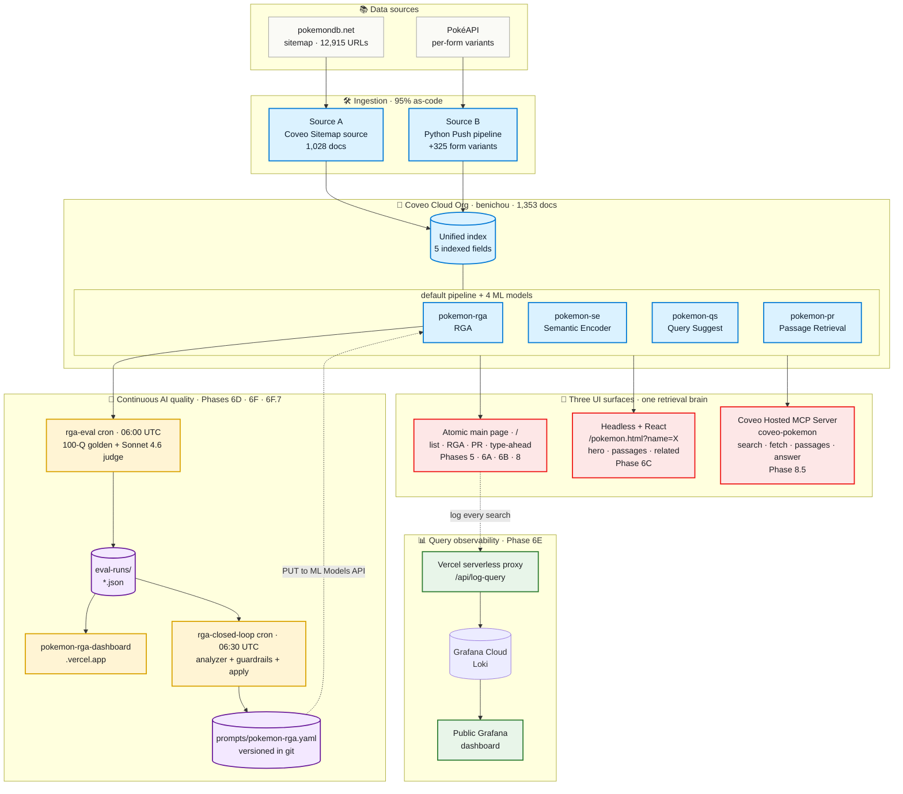

# Coveo Pokemon Challenge

Forward Deployed Engineer technical challenge for Coveo. A Pokémon search experience built on the **Coveo Cloud Platform**, indexing [pokemondb.net](https://pokemondb.net) + [PokéAPI](https://pokeapi.co) — combined with a quantitative **AI-quality measurement system** and an **autonomous closed-loop prompt-tuning system**, end-to-end through code.

| | URL |
|---|---|
| **Live Pokémon search UI** (Atomic) | [pokemon-search-one-chi.vercel.app](https://pokemon-search-one-chi.vercel.app) |
| **Live Pokémon detail page** (Headless + React) | [pokemon-search-one-chi.vercel.app/pokemon.html?name=charizard](https://pokemon-search-one-chi.vercel.app/pokemon.html?name=charizard) |
| **Live RGA quality dashboard** | [pokemon-rga-dashboard.vercel.app](https://pokemon-rga-dashboard.vercel.app) |
| **Live query-observability dashboard** (Grafana, public) | [charmingporridge966.grafana.net/public-dashboards/cf105c8d…](https://charmingporridge966.grafana.net/public-dashboards/cf105c8dabc64e5b95a33a86ef502452) |
| **GitHub repo** | [github.com/benichou/coveo-pokemon-challenge](https://github.com/benichou/coveo-pokemon-challenge) |
| **Diagnostic methodology** (panel-shareable) | [`docs/rga-eval-methodology.md`](docs/rga-eval-methodology.md) |
| **Query observability architecture** (panel-shareable) | [`docs/observability.md`](docs/observability.md) |
| **Caching strategy** (panel-shareable) | [`docs/caching-strategy.md`](docs/caching-strategy.md) |
| **Passage Retrieval architecture** (panel-shareable) | [`docs/passage-retrieval.md`](docs/passage-retrieval.md) |
| **Pokémon Detail Page architecture** (panel-shareable) | [`docs/detail-page.md`](docs/detail-page.md) |
| **Coveo MCP Server integration** (panel-shareable) | [`docs/mcp-integration.md`](docs/mcp-integration.md) |
| **RGA Custom Prompt + history** | [`docs/rga-prompt.md`](docs/rga-prompt.md) + [`rga-closed-loop/prompts/`](rga-closed-loop/prompts/) |
| **Working plan** (history + decisions) | [`~/.claude/plans/so-we-are-supposed-purrfect-bachman.md`](~/.claude/plans/so-we-are-supposed-purrfect-bachman.md) |

## What this repo demonstrates

Beyond a working Pokémon search UI, this build is a panel-defining demonstration of **production-grade AI** practices:

1. **Continuous AI-quality measurement.** A 100-question golden dataset, an LLM-as-judge with Pydantic-enforced structured output, and a daily GitHub Actions cron that writes time-series JSON to git — all visualized on a public dashboard.
2. **Closed-loop self-improvement.** An LLM-assisted analyzer reads the **last 5 eval runs** (multi-day window — distinguishes chronic failure patterns from one-day LLM-judge noise via persistence + drift signals), identifies the worst categories, samples failing answers verbatim from the latest run, and proposes prompt refinements. The proposals can be applied interactively (via a Claude Code skill, `/rga-closed-loop`) or autonomously (via a GitHub Actions cron gated by guardrails). Every prompt version that has been live on the model is rendered on the quality dashboard with a chart marker on its apply date and an expandable line-level diff vs the prior version.
3. **Code as the source of truth for AI configuration.** The RGA Custom Prompt lives as version-controlled YAML in the repo; an apply script PUTs it to Coveo's ML Models API. No Console click-paste in production.
4. **95% reproducible infrastructure.** Source config, fields, mappings, scraping rules, URL filters, ML model wiring — all version-controlled JSON + bash. One-command bootstrap (`scripts/bootstrap.sh`). The only manual step is API-key minting (Coveo's deliberate "secret-once" design).
5. **Two-tier observability.** AI quality (Phase 6D) measures answer correctness. [Query observability (Phase 6E)](docs/observability.md) — a same-origin Vercel proxy forwarding per-search records to Grafana Cloud Loki, fronted by a dashboard-as-code that auto-deploys from `main` — measures user behavior. Different stakeholders, different cadences, same dashboard discipline.
6. **Two Coveo client libraries, one project.** The Atomic main page (`/`) ships the list view; the [Pokémon Detail Page](docs/detail-page.md) (`/pokemon.html?name=<slug>`) ships a Headless + React deep dive composing **three parallel Coveo queries** — Search API for the hero, Passage Retrieval for verifiable insights (with a noise-score ranker + flattened-table reconstructor to keep PR chunks readable), and a second Headless engine for a same-generation related grid. Multi-entry Vite build, shared `.env`, one Vercel deploy. Picking the right Coveo SDK per surface — the FDE narrative compressed into one repo.
7. **The same Coveo org is also an AI-agent surface.** The [Coveo Hosted MCP Server](docs/mcp-integration.md) (Phase 8.5) exposes our pokemon index as four MCP tools — `search`, `fetch`, `get_passages`, `answer` — to any MCP-compatible client (Claude Code, Claude Desktop, ChatGPT Enterprise, ...). The Atomic UI, the Headless+React detail page, AND now Claude Code itself all query the **same org, same pipeline, same models, same index** — three UI surfaces, one retrieval brain. Customer-pitch slide: *"your Coveo investment is your AI-agent investment, zero new integrations."*

## Status (2026-06-03, end of day)

```
✅ Phase 0  — repo, dev env, API keys, org acceptance
✅ Phase 1  — Sitemap source: 1,028 Pokémon indexed via versioned scraping config
✅ Phase 2  — 5 indexed fields + source mappings, clean values verified
✅ Phase 3  — Console hosted search page validated (search, facets, badges)
✅ Phase 4  — Source B: Python Push pipeline — per-form docs via PokéAPI
✅ Phase 5  — Local Atomic UI with RGA panel, facets, sort
✅ Phase 6A — RGA model + Semantic Encoder + pipeline associations
✅ Phase 6D — RGA Skill Evaluator + dashboard + daily cron + live Vercel deploy
✅ Phase 6F — Closed-loop prompt-tuning: analyzer + skill + cron + guardrails
✅ Phase 7  — Atomic search UI live on Vercel (pokemon-search-one-chi.vercel.app)
✅ Phase 6E — Grafana Cloud query observability (public dashboard live, dashboard-as-code via CI)
✅ Phase 6F.7 — Closed-loop smoothing + dashboard prompt-history (multi-day analyzer + chart markers + diffs)
✅ Phase 6B — Query Suggest (type-ahead) — model live + cold-start solved via Default Queries CSV (Advanced Model Configurations API)
✅ Phase 8  — Passage Retrieval API — panel below RGA, markdown-it rendering, observability extended
✅ Phase 6C — Pokémon Detail Page (Headless + React) — multi-entry Vite, three composed Coveo surfaces
✅ Phase 8.5 — Coveo MCP Server integration — pokemon-mcp server live; 4 tools (search / fetch / get_passages / answer) wired into Claude Code via .claude/mcp.json

⏳ Phase 9  — Presentation #1: Pokémon Challenge (Topic 1 + Topic 2)
⏳ Phase 10 — Presentation #2: Escalation & Recovery
```

## Architecture



### Four flows worth tracing on the diagram

1. **Ingestion (top-down)**: pokemondb.net's sitemap feeds Source A (Coveo's Sitemap source, 1,028 docs); PokéAPI feeds Source B (a Python Push pipeline, +325 per-form variants). Both land in the same Coveo org. Every step is versioned in `config/` + `scripts/`.
2. **Three surfaces, one brain**: the same Coveo pipeline + four ML models powers (a) the Atomic main page at `/`, (b) the Headless + React detail page at `/pokemon.html?name=X`, and (c) the Coveo Hosted MCP Server addressable from Claude Code, Claude Desktop, and ChatGPT Enterprise. **Picking the right Coveo SDK per surface — the FDE narrative compressed.**
3. **Closed loop (the dotted feedback arrow on the right)**: every day at 06:00 UTC, `rga-eval` measures RGA quality against a 100-question golden dataset using Sonnet 4.6 as judge → writes `eval-runs/*.json` → the public dashboard rebuilds → at 06:30 UTC, `rga-closed-loop` reads the last 5 runs, proposes a prompt refinement, runs it through guardrails, and (if approved) PUTs the new prompt to Coveo's ML Models API. The prompt YAML is the source of truth; the Coveo Console mirrors it. **Code-as-source-of-truth for AI configuration.**
4. **Parallel observability (the dotted arrow on the left)**: every user search on the Atomic page fires a fire-and-forget log to a same-origin Vercel proxy → Grafana Cloud Loki → public dashboard. The Loki write token never reaches the browser. **Two-tier observability — AI quality + user behavior — same dashboard discipline.**

Beyond the diagram, three more code-as-source-of-truth artifacts that aren't shown (intentionally — they're configuration, not data flow): `config/source/` (URL filter + scraping config + source definition), `config/ml/default-queries.json` (QS seed CSV applied via Coveo's Advanced Model Configurations API), `config/mcp/pokemon-mcp.yaml` (Hosted MCP Server config — manually mirrored to Console until Coveo publishes the admin API).

## Two parallel narratives, one repo

| Build | Lives at | Phase |
|---|---|---|
| **The Pokémon search experience** | `config/` + `scripts/` + `push-pokemon/` + `atomic-search/` | 0 – 6A |
| **The AI-quality measurement system** | `rga-eval/` + `rga-dashboard/` + `eval-runs/` + `.github/workflows/rga-eval-daily.yml` | 6D |
| **The closed-loop prompt-tuning system** | `rga-closed-loop/` + `.claude/skills/rga-closed-loop/` + `.github/workflows/closed-loop-daily.yml` | 6F |

The first is the Coveo deliverable. The second + third are the panel-defining add-ons that demonstrate **how production AI should actually be operated**.

## Getting started (new contributor onboarding)

The repo is designed so a fresh contributor can replicate the org setup with one bootstrap command, given a Coveo org and the five API keys.

### 1. Prerequisites

- Node 20+, Python 3.12+, `git`, `gh` (GitHub CLI), `curl`, `jq`, `uv` ([astral.sh/uv](https://docs.astral.sh/uv/))
- A Coveo Cloud organization with these features licensed:
  - Passage Retrieval API
  - Relevance Generative Answering (CRGA)
  - Automatic Relevance Tuning
- A personal Anthropic API key (free $5 signup credit covers the build phase)

### 2. Clone and set up `.env`

```bash
git clone https://github.com/benichou/coveo-pokemon-challenge.git
cd coveo-pokemon-challenge
cp .env.example .env
```

### 3. Install pre-commit hooks (recommended)

This repo uses **[ruff](https://docs.astral.sh/ruff/)** via **[pre-commit](https://pre-commit.com/)**. Every `git commit` automatically lints + formats staged Python files.

```bash
brew install pre-commit           # macOS, preferred
# or: uv tool install pre-commit
# or: pipx install pre-commit
pre-commit install                # registers the hook in this clone
```

If ruff auto-fixes anything, the commit aborts; review, `git add`, re-commit. Run `pre-commit run --all-files` to lint everything outside a commit.

Config: `.pre-commit-config.yaml` (hooks) + `ruff.toml` (style — line 88, PEP 8, isort, bugbear, naming). The same `ruff.toml` is what VS Code reads for format-on-save.

### 4. Create the five API keys

Follow **[docs/api-keys.md](docs/api-keys.md)** to mint all five in the Coveo Admin Console:

| Key | Template | Used by |
|---|---|---|
| `pokemon-push-source` | Push API | `push-pokemon/` ingestion pipeline |
| `pokemon-source-admin` | Custom (Sources + Fields + Pipelines Edit, ML Models View) | `scripts/` ops |
| `pokemon-search` | Anonymous Search (public-safe) | `tests/`, `atomic-search/`, RGA generate calls |
| `pokemon-rga-judge` | Custom (Knowledge.Answer Manager: Edit) | `rga-eval/` answer-config discovery |
| `pokemon-ml-models-editor` | Custom (Machine Learning Models: Edit) | `rga-closed-loop/apply.py` for prompt PUTs |

Plus a personal Anthropic key for the LLM-as-judge + closed-loop analyzer. Five Coveo keys instead of one is deliberate least-privilege scoping (Coveo enforces immutable post-creation privileges, so different roles → different keys).

### 5. Bootstrap the org

```bash
scripts/bootstrap.sh
```

Single idempotent command:
1. Validates required licensed features
2. Validates the five API keys' privileges (least-privilege check)
3. Creates the 5 Coveo fields if missing
4. Creates the Sitemap source if missing
5. Applies the versioned web scraping configuration
6. Adds the 5 source mappings
7. Narrows the URL filter to a single Pokémon (safe starting scope)
8. Triggers an initial rebuild

Then widen the crawl:

```bash
scripts/source/widen.sh all       # update URL filter to all ~1,025 Pokémon
scripts/source/rebuild.sh         # ~17 min crawl at 1 req/sec
```

### 6. Verify (optional, recommended)

```bash
cd tests && uv run pytest         # 21 integration tests against the live org + sitemap
```

## Opening Claude Code in this repo

This repo ships a `CLAUDE.md` at the root (auto-loaded every session), a project-scoped `.claude/` directory, three Claude Code skills (`/rga-eval`, `/rga-closed-loop`, `/pokemon-mcp`), and one project-scoped MCP server (`coveo-pokemon`, Phase 8.5). To open Claude Code with **only this repo's tooling** — ignoring any global skills/MCP configured in `~/.claude/`:

```bash
claude --setting-sources project --strict-mcp-config --mcp-config .claude/mcp.json
```

| Flag | Effect |
|---|---|
| `--setting-sources project` | Loads ONLY `./.claude/settings.json`; ignores user-level + enterprise settings. |
| `--strict-mcp-config` | Disables user-level + enterprise MCP server discovery. |
| `--mcp-config .claude/mcp.json` | Loads MCP servers from the repo's `.claude/mcp.json` (declares the `coveo-pokemon` Hosted MCP server — Phase 8.5; needs `COVEO_MCP_ENDPOINT` + `COVEO_MCP_API_KEY` in the env to resolve). |

**Caveat:** Skills in `~/.claude/skills/` still auto-load alongside the repo's `.claude/skills/`. For full skill isolation add `--bare` (at the cost of manually registering the repo's skills in `.claude/settings.json`).

## Claude Code skills

```
/rga-eval                       Phase 6D — run / inspect the RGA evaluator
/rga-eval full                  → fresh 100-Q eval (~10 min, ~$0.60 Sonnet)
/rga-eval smoke                 → 5-Q smoke test (~30s)
/rga-eval failures              → drill into failing questions
/rga-eval compare D1 D2         → diff metrics between two runs

/rga-closed-loop                Phase 6F — drive the closed-loop tuning system
/rga-closed-loop analyze        → analyzer + interactive review + apply if approved
/rga-closed-loop apply          → apply current YAML to Coveo (no analyzer)
/rga-closed-loop verify         → read-only: does live Coveo match YAML?
/rga-closed-loop rollback DATE  → restore prompts/history/<date>.yaml + apply

/pokemon-mcp                    Phase 8.5 — demo the Coveo MCP Server integration
/pokemon-mcp info               → explain the integration (no API calls)
/pokemon-mcp tools              → list the four MCP tools + when to pick each
/pokemon-mcp demo               → run the 4-query panel demo through MCP
/pokemon-mcp compare "<query>"  → call MCP for <query>, contrast with the live UI
```

All three skills auto-trigger on natural-language asks ("what's the latest RGA accuracy?", "tune the prompt", "demo MCP"). Full mode lists in `.claude/skills/<name>/SKILL.md`.

## Using the Coveo MCP integration (Phase 8.5)

The repo's `coveo-pokemon` MCP server makes our Pokémon Coveo org queryable from any MCP-compatible client — Claude Code, Claude Desktop, ChatGPT Enterprise, etc. — through four tools: `search`, `fetch`, `get_passages`, `answer`. For the full architecture, see [`docs/mcp-integration.md`](docs/mcp-integration.md). For the source-of-truth server configuration (Console state mirrored as code), see [`config/mcp/pokemon-mcp.yaml`](config/mcp/pokemon-mcp.yaml).

### Prerequisites (one-time)

1. The `pokemon-mcp` server must be configured in Coveo Admin Console → AI & ML → MCP Server. Mirror what's in `config/mcp/pokemon-mcp.yaml` (server instructions, tools, auth method, etc.) — see `config/mcp/README.md` for the manual-paste workflow.
2. The 6th API key (`COVEO_MCP_API_KEY`, auto-created by Coveo when you set up the MCP server) must be in your local `.env`. See [`docs/api-keys.md`](docs/api-keys.md) → Key 6.
3. The per-server endpoint URL must be in your local `.env` as `COVEO_MCP_ENDPOINT`. Visible in the Console MCP Server Overview tab → Details → Endpoint.

### Launch Claude Code with the MCP server connected

From the repo root, in a fresh terminal:

```bash
set -a; source .env; set +a
claude --setting-sources project --strict-mcp-config --mcp-config .claude/mcp.json
```

The `set -a; source .env; set +a` line exports every variable in `.env` to the shell environment so Claude Code can resolve `${COVEO_MCP_ENDPOINT}` and `${COVEO_MCP_API_KEY}` from `.claude/mcp.json`. Without this, the MCP server will fail to connect (401 on tool calls).

### Verify the connection

Inside Claude Code:

```
/mcp
```

Expected output: `coveo-pokemon` listed with status `connected` and four tools — `search`, `fetch`, `get_passages`, `answer`. If status is `failed`, double-check the env vars are exported (`echo $COVEO_MCP_API_KEY | head -c 8` to print only the prefix, not the full key).

### Run the panel demo

```
/pokemon-mcp demo
```

This runs **four curated queries against the live MCP server**, narrating what each one demonstrates:

| Query | Tool called | What it shows |
|---|---|---|
| *"what type is Charizard?"* | `answer` | Grounded RGA response with citation to pokemondb.net |
| *"fire-type Pokémon from Generation 1"* | `search` | Ranked list + LLM self-flagging that "Generation 1" was a keyword search, not a structured filter |
| *"top 3 passages about Mewtwo's psychic abilities"* | `get_passages` | 3 verbatim chunks with relevance scores; LLM flags they're all from the same source doc |
| *"fetch the full document for Bulbasaur"* | `search` → `fetch` | Multi-tool chaining: LLM autonomously calls `search` first to find the ID, then `fetch`. Discovers the index's structured fields mid-conversation and proposes a refined `advancedQuery` for the earlier Gen-1 fire query. |

~60-90 seconds of live agent activity, with the tool-call indicator visible in the Claude Code UI. **This is the panel demo.**

### Other skill modes

```
/pokemon-mcp info                       # explain the integration (no API calls)
/pokemon-mcp tools                      # list the four MCP tools + when to pick each
/pokemon-mcp compare "<your query>"     # call MCP for <query>, then describe what the live Vercel UI would show for the same input
```

### Natural-language invocation

The skill also auto-triggers on plain English — no slash needed:

- *"Demo the MCP integration"* → `demo` mode
- *"Show me how MCP works here"* → `info` mode
- *"List the MCP tools"* → `tools` mode
- *"How would MCP answer 'who is Pikachu?' vs our live UI?"* → `compare` mode

### Calling MCP tools directly (without the skill)

You can also bypass the skill and ask Claude Code to call MCP tools naturally — the four tools are always available in the tool catalog once the server is connected:

- *"Use the Coveo MCP server to answer: what's special about Eevee's evolutions?"* → Claude picks `answer` based on the server's tool-selection guide
- *"Search Coveo for ghost-type Pokémon"* → Claude picks `search`
- *"Fetch the Coveo document for Mewtwo"* → Claude picks `search` → `fetch`

The skill is a curated demo script; everyday usage is just natural-language prompts that mention MCP or Coveo.

### Editing the server configuration

The Coveo Console is the live state, but `config/mcp/pokemon-mcp.yaml` is the source of truth. To change anything (server instructions, tool descriptions, auth methods):

1. Edit `config/mcp/pokemon-mcp.yaml`, bump the version, add a `history` entry
2. Paste the changed section into the matching Console tab (`config/mcp/README.md` lists which section goes where)
3. Save in the Console, commit the YAML

Coveo doesn't yet publish a public REST admin API for the MCP Server (confirmed by `scripts/mcp/discover_api.sh` — 8 candidate endpoints all returned 404). Re-run that script periodically; the day a 200 appears, replace the manual paste step with `scripts/mcp/apply_mcp_server.sh`.

## The AI-quality + closed-loop systems (Phases 6D + 6F)

### What the daily cron does without anyone touching it

```
06:00 UTC  rga-eval-daily.yml fires
           → 100-question eval against the live RGA model
           → Sonnet 4.6 judges every answer via tool-use forcing
           → bot commits eval-runs/YYYY-MM-DD-full.json to main
           → Vercel rebuilds the dashboard with the new data point

06:30 UTC  closed-loop-daily.yml fires (triggered by upstream completion)
           → Rollback check: if today's eval dropped > 5pts within 36h
             of the last apply → auto-revert to prompts/history/<prev>.yaml
           → Otherwise: analyzer reads latest run, samples failing answers
             from worst categories, calls Sonnet 4.6 → PromptProposal
           → Guardrails check (confidence ≥ 0.80, lift ≥ +5pts, sanity,
             rate-limit ≥ 3 days since last apply, no-op detection)
           → If all pass: archive current YAML to history/, write new
             YAML, run apply.py --apply (PUT to Coveo /machinelearning/
             models/{id}), verify via re-fetch, bot commits everything
           → Audit log written to logs/closed-loop/ regardless of outcome
```

### How the dashboard works

The Vercel-hosted dashboard at `rga-dashboard/` reads every `eval-runs/*-full.json` at **build time** (Vite's `import.meta.glob`, no runtime fetch, no API keys in the browser) and renders:

- A KPI snapshot of the latest run with Δ vs the previous run
- A time-series chart of accuracy / precision / hard-recall / citation-precision (overall + per layer)
- A per-category breakdown sorted worst-first
- A per-question drill-down with judge reasoning, false claims, and the raw RGA answer

```bash
cd rga-dashboard
npm install
npm run dev      # local: http://localhost:5173
npm run build    # → dist/ for Vercel
```

Deploy: import the repo in Vercel, set **Root Directory** to `rga-dashboard`. Framework auto-detects as Vite. Zero env vars (the dashboard is a static site).

The full Vercel + GitHub-Actions-secrets runbook: **[`docs/deploy.md`](docs/deploy.md)**.

### Closed-loop guardrails (why we can ship autonomous prompt changes)

| Guard | Default | What it prevents |
|---|---|---|
| **Confidence** | analyzer self-rated ≥ 0.80 | Vibes-based suggestions |
| **No-op** | proposal differs from current | Wasting a Coveo API call |
| **Lift threshold** | predicted overall accuracy lift ≥ +5pts | Trivial churn |
| **Sanity** | prompt ≥ 500 chars + contains "retrieved" + "source" | Catastrophic analyzer collapse |
| **Rate limit** | last apply ≥ 3 days ago | Compounding bad changes |
| **Auto-rollback** | next-day eval > 5pt drop within 36h of apply | Bad change silently degrading prod |

The skill (`/rga-closed-loop analyze`) replaces the guardrails with **interactive human review** for ad-hoc iteration. The cron uses the guardrails for autonomous operation. Same `analyzer.py` + `apply.py` core; two different orchestration shells.

## Repository layout

```
coveo-pokemon-challenge/
├── README.md                    ← you are here (panel-shareable narrative)
├── CLAUDE.md                    ← operational reference auto-loaded into every Claude session
├── .env.example                 ← copy to .env and fill with 5 Coveo keys + Anthropic key
├── .gitignore
├── .pre-commit-config.yaml      ← ruff + file hygiene
├── ruff.toml                    ← linter + formatter config (line 88, PEP 8, isort, …)
├── .vscode/                     ← shared workspace settings (format-on-save with ruff)
│
├── .github/workflows/
│   ├── rga-eval-daily.yml       ← daily 06:00 UTC RGA eval + manual trigger
│   ├── closed-loop-daily.yml    ← daily 06:30 UTC closed-loop (post-eval) + manual trigger
│   └── pr-checks.yml            ← on pull_request + push to main: pre-commit + tests + build + TruffleHog
│
├── .claude/                     ← project-scoped Claude Code config
│   ├── settings.json            ← marker for `--setting-sources project`
│   ├── mcp.json                 ← project-scoped MCP servers (declares coveo-pokemon — Phase 8.5)
│   └── skills/
│       ├── rga-eval/SKILL.md            ← /rga-eval slash command
│       ├── rga-closed-loop/SKILL.md     ← /rga-closed-loop slash command
│       └── pokemon-mcp/SKILL.md         ← /pokemon-mcp slash command (Phase 8.5 demo)
│
├── docs/
│   ├── api-keys.md              ← all 5 Coveo keys + their privileges, recreation steps
│   ├── ml-models.md             ← RGA + Semantic Encoder + Query Suggest: what, why, how
│   ├── deploy.md                ← GitHub Actions secrets + Vercel project setup
│   ├── rga-prompt.md            ← RGA Custom Prompt narrative + change log
│   ├── rga-eval-methodology.md  ← six-stage diagnostic loop (panel-shareable)
│   ├── observability.md         ← query-level Grafana architecture (panel-shareable)
│   ├── caching-strategy.md      ← multi-tier caching decision (panel-shareable)
│   ├── passage-retrieval.md     ← PR architecture + Coveo positioning (panel-shareable)
│   ├── detail-page.md           ← Headless + React detail page architecture (panel-shareable)
│   └── mcp-integration.md       ← Coveo Hosted MCP Server integration (panel-shareable)
│
├── config/                      ← versioned Coveo configuration
│   ├── fields.json              ← index field schema
│   ├── source/                  (source-specific config)
│   │   ├── definition.json
│   │   ├── scraping.json
│   │   └── url_filter.json      ← read by scripts AND tests (single source of truth)
│   ├── ml/                      (machine learning seed data — Phase 6B)
│   │   ├── default-queries.json
│   │   └── default-queries.csv
│   └── mcp/                     (MCP Server config — Phase 8.5)
│       ├── pokemon-mcp.yaml     ← source-of-truth for the Hosted MCP Server
│       └── README.md            ← versioning + manual-paste workflow
│
├── scripts/                     ← idempotent ops scripts (Coveo REST API)
│   ├── bootstrap.sh             ← one-command full provisioning
│   ├── validate/                  (read-only preflight checks)
│   ├── setup/                     (idempotent resource creation)
│   ├── source/                    (source lifecycle ops)
│   ├── ml/                        (machine learning wiring)
│   ├── mcp/                       (MCP Server diagnostics — Phase 8.5)
│   └── audit/                     (post-processing data quality)
│
├── push-pokemon/                ← Python Push-source ingestion (Phase 4)
│   └── (PokéAPI per-form docs into Source B)
│
├── atomic-search/               ← Vite project, two entry points:
│                                    - index.html  → Atomic main search page (Phase 5)
│                                    - pokemon.html → Headless + React detail page (Phase 6C)
│                                  Shipped to Vercel as one deploy (Phase 7).
│
├── rga-eval/                    ← Phase 6D — daily quality monitoring
│   ├── golden/questions.json    ← 100 hand-crafted Q's (50 L1 / 35 L2 / 15 L3)
│   ├── src/
│   │   ├── schemas.py           ← Pydantic: GoldenQuestion / JudgeVerdict / EvalRun
│   │   ├── coveo_rga.py         ← /answer/v1/configs/{id}/generate SSE client
│   │   ├── llm_judge.py         ← Sonnet 4.6 with tool-use forcing
│   │   ├── metrics.py           ← accuracy / precision / hard-recall computation
│   │   ├── publish.py + show.py ← write + pretty-print eval-runs JSON
│   │   └── main.py              ← orchestrator (--limit / --layer / --dry-run)
│   └── tests/test_schemas.py    ← 6 dataset-shape tests
│
├── eval-runs/                   ← one JSON per day; commit history = time-series DB
│   └── YYYY-MM-DD-<mode>.json
│
├── rga-dashboard/               ← Phase 6D.6 — Vercel-hosted Vite + React + recharts
│   ├── src/
│   │   ├── App.tsx              ← page shell
│   │   ├── loadRuns.ts          ← bundles eval-runs/*-full.json at build time
│   │   ├── schemas.ts           ← TS mirror of rga-eval/src/schemas.py
│   │   └── components/          ← SummaryCard, TimeSeries, CategoryBreakdown, FailuresTable
│   └── vercel.json
│
├── rga-closed-loop/             ← Phase 6F — closed-loop prompt-tuning
│   ├── README.md                ← panel-shareable overview
│   ├── prompts/
│   │   ├── pokemon-rga.yaml     ← CURRENT live prompt + structured metadata
│   │   └── history/             ← previous prompt versions, dated YAMLs
│   ├── src/
│   │   ├── schemas.py           ← Pydantic: PromptVersion + PromptProposal
│   │   ├── apply.py             ← PUT prompt to Coveo (dry-run default, --apply, --force)
│   │   ├── analyzer.py          ← Sonnet 4.6 proposes prompt refinements
│   │   ├── guardrails.py        ← confidence / lift / sanity / rate-limit / auto-rollback
│   │   └── closed_loop_run.py   ← cron orchestrator (rollback-check + analyzer + guard + apply)
│   └── tests/                   ← 38 unit tests (apply + guardrails), respx-mocked, no live calls
│
├── logs/closed-loop/            ← audit trail (one JSON per closed-loop run)
│
└── tests/                       ← integration tests against the live org (21 tests, ~3s)
    ├── test_url_set_parity.py   ← sitemap-filtered set == indexed set
    ├── test_index_audit.py      ← every URI is a real Pokémon (PokéAPI + HTML check)
    ├── test_field_extraction.py ← 8 spot-check Pokémon, all 5 fields
    ├── test_facet_counts.py
    └── test_search_queries.py
```

## Design decisions worth knowing

- **Sitemap source over Web Crawler.** pokemondb.net publishes a sitemap; Coveo's "Leading Practices" explicitly prefer Sitemap source when available — faster, more reliable, same scraping rules apply.
- **Five API keys, not one.** Coveo enforces immutable post-creation privileges → different roles need different keys. Least-privilege scoping limits blast radius: the search key (browser-safe) cannot edit anything; the admin key can edit sources but not write ML models; the ml-models key can write ML models but cannot query.
- **Config as code.** Every Coveo resource — URL filter, scraping rules, mappings, fields, ML model prompt — is versioned in this repo as JSON / YAML + a bash or Python script that applies it via REST. ~95% reproducible from scratch.
- **Dual-source ingestion.** Source A (Sitemap) captures Pokémon at the page level; Source B (Push) captures them at the form level (Mega, Hisuian, Galarian, …) via PokéAPI — preserving form→type associations Source A can't.
- **AI quality is a first-class concern.** Phase 6D measures it daily; Phase 6F closes the loop on it. The default Coveo enterprise template (with unfilled `[Enterprise Name]` placeholders) was the latent cause of our baseline failure modes — the kind of misconfiguration only a measurement system can surface. See [`docs/rga-eval-methodology.md`](docs/rga-eval-methodology.md) for the diagnostic walkthrough.
- **Skill + cron, not skill OR cron.** The same `analyzer.py` + `apply.py` core drives both an interactive Claude Code skill (for dev iteration + panel demos) and an autonomous GitHub Actions cron (for production). Two orchestration shells, one engine.
- **Code-as-source-of-truth even for AI prompts.** The RGA Custom Prompt lives as YAML in `rga-closed-loop/prompts/pokemon-rga.yaml`; the live Coveo Console value is what gets PUT *to*, never the source. Every change is diffable in git; rollback is `cp history/X.yaml prompts/pokemon-rga.yaml && uv run python src/apply.py --apply`.

## License

MIT
