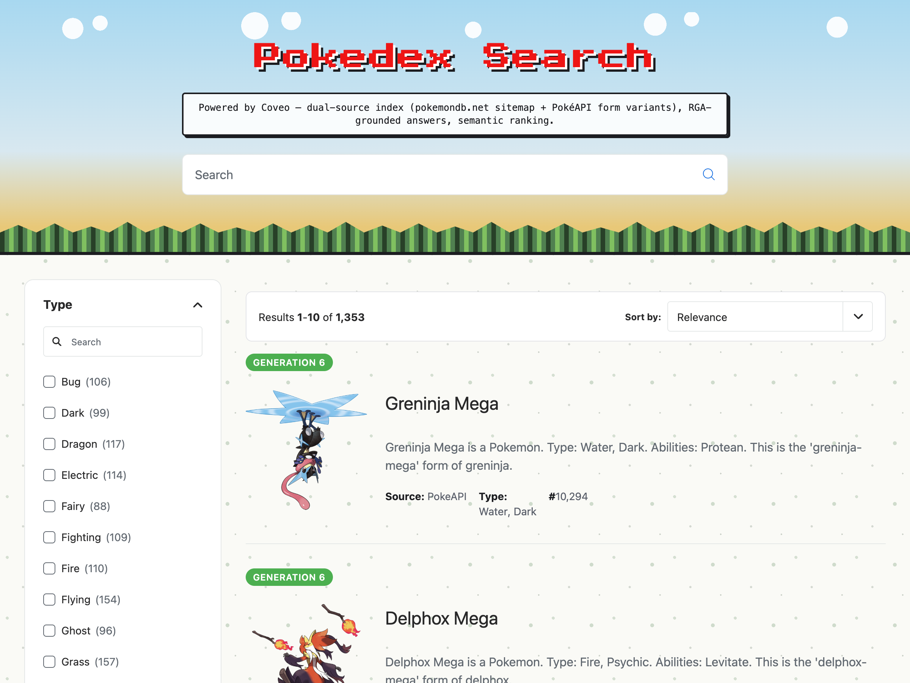
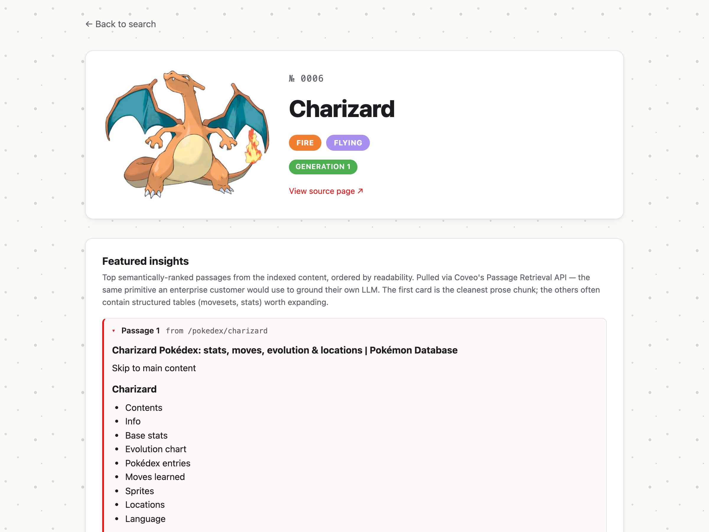
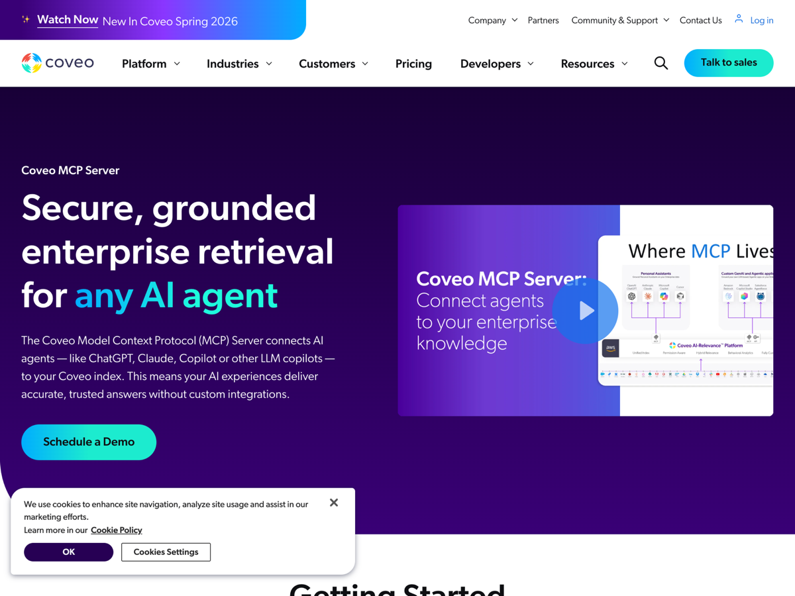
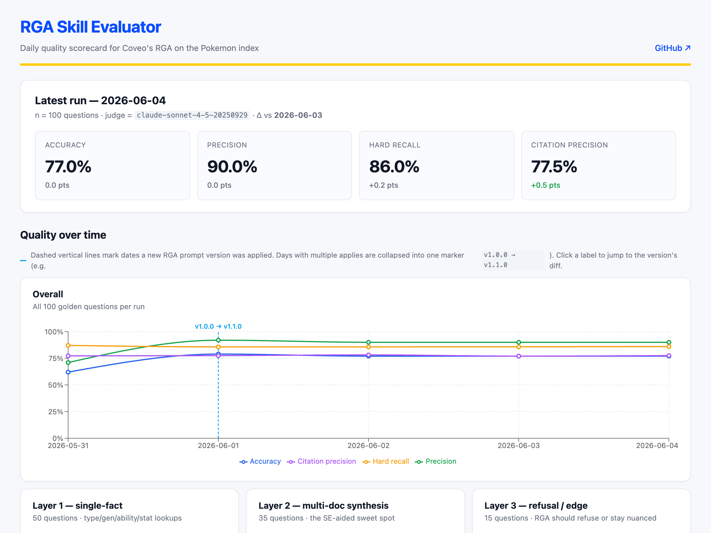
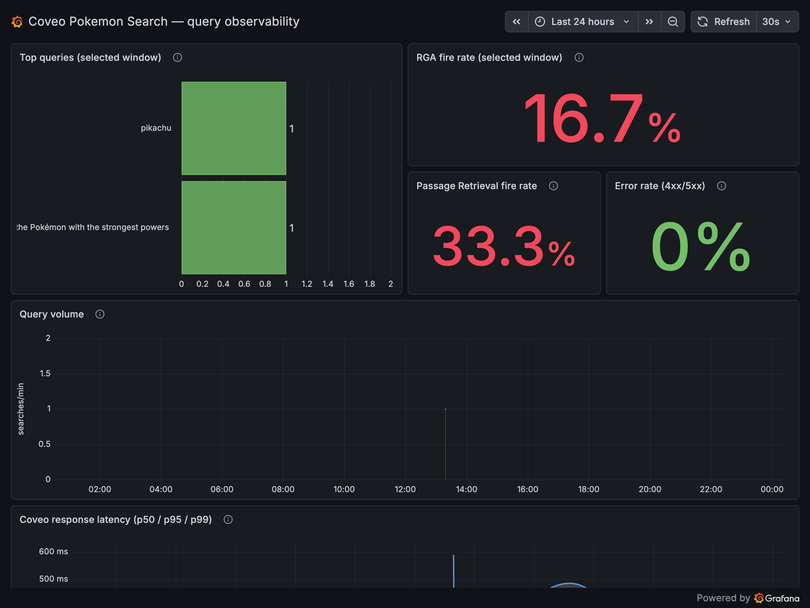

<!-- _class: cover -->
<!-- _paginate: false -->
<!-- _footer: "" -->

# Pokédex Search

## A Coveo FDE technical challenge

**Franck Benichou** · Forward Deployed Engineer candidate

<div class="links">
  <div>🔍 Live app · <a href="https://pokemon-search-one-chi.vercel.app">pokemon-search-one-chi.vercel.app</a></div>
  <div>💻 GitHub · <a href="https://github.com/benichou/coveo-pokemon-challenge">github.com/benichou/coveo-pokemon-challenge</a></div>
  <div>🔬 RGA performance monitoring · <a href="https://pokemon-rga-dashboard.vercel.app">pokemon-rga-dashboard.vercel.app</a></div>
  <div>📊 Query observability · <a href="https://charmingporridge966.grafana.net/public-dashboards/cf105c8dabc64e5b95a33a86ef502452">grafana public dashboard</a></div>
</div>

<!--
Speaker notes (hidden in slide, visible in presenter mode):

"Hi — I'm Franck. Over the next ~10 minutes I'll walk through the Pokémon
Challenge build. We'll do the live demo early — right after the architecture
diagram — and then drill into the choices behind it. Q&A at the end."

Key message: the URLs are live and you can follow along on your phone.
-->

---

# What I built

<p class="tagline">
A Pokémon-themed search experience on Coveo Cloud —<br>
<strong>three user-facing surfaces</strong> powered by <strong>one Coveo brain</strong>.
</p>

<div class="three-up">
  <a href="https://pokemon-search-one-chi.vercel.app" target="_blank" rel="noreferrer">
    
    <p class="three-up-label">Atomic main page</p>
  </a>
  <a href="https://pokemon-search-one-chi.vercel.app/pokemon.html?name=charizard" target="_blank" rel="noreferrer">
    
    <p class="three-up-label">Pokémon Detail Page</p>
  </a>
  <a href="https://www.coveo.com/en/developers/mcp-server" target="_blank" rel="noreferrer">
    
    <p class="three-up-label">Coveo MCP Server</p>
  </a>
</div>

<!--
Speaker notes:

"Doc 2's brief is essentially: index pokemondb.net into a Coveo org and ship
a custom search experience on top. That's the deliverable."

"But the challenge also asks for Advanced and Bonus tier work. I went full
ambition — every advanced item, the bonus, plus three things Doc 2 didn't
ask for. I'll get to those."

"Single screenshot recap before we get into the *how*."

Key message: scope = full ambition, not the minimum that passes.
-->

---

<!-- _class: architecture -->

# Architecture · one Coveo org, three UI surfaces, two loops

<div class="arch">

<div class="arch-row">
  <div class="arch-zone zone-data">
    <p class="arch-zone-title">📚 Data sources</p>
    <div class="arch-zone-body">
      <div class="arch-line">pokemondb.net <small>sitemap · 12,915 URLs · public site</small></div>
      <div class="arch-line">PokéAPI <small>per-form variants · Mega / Hisuian / Galarian</small></div>
    </div>
  </div>
  <div class="arch-arrow">→</div>
  <div class="arch-zone zone-ingest">
    <p class="arch-zone-title">🛠️ Ingestion · 95% as-code</p>
    <div class="arch-zone-body">
      <div class="arch-line">Source A · Coveo Sitemap source <small>1,028 docs · versioned scraping config</small></div>
      <div class="arch-line">Source B · Python Push pipeline <small>+325 form variants · enrichment via PokéAPI</small></div>
    </div>
  </div>
  <div class="arch-arrow">→</div>
  <div class="arch-zone zone-coveo">
    <p class="arch-zone-title">🧠 Coveo Cloud Org · benichou</p>
    <div class="arch-zone-body">
      <div class="arch-line">Unified index <small>1,353 docs · 5 indexed fields · least-privilege API keys</small></div>
      <div class="arch-line"><strong>4 ML models on default pipeline</strong><br><small>RGA · Semantic Encoder · Query Suggest · Passage Retrieval</small></div>
    </div>
  </div>
</div>

<div class="arch-down">↓</div>

<div class="arch-row arch-row-surfaces">
  <div class="arch-zone zone-surfaces" style="flex: 1;">
    <p class="arch-zone-title">🎯 Three UI surfaces · one retrieval brain</p>
    <div class="arch-three-surfaces">
      <div class="arch-surface">
        <strong>Atomic main page</strong>
        <code>/</code>
        <small>list view · RGA panel · PR panel · Query Suggest type-ahead · GBC-themed UI</small>
      </div>
      <div class="arch-surface">
        <strong>Pokémon Detail Page</strong>
        <code>/pokemon.html?name=X</code>
        <small>Headless + React · three parallel Coveo queries (hero · passages · related)</small>
      </div>
      <div class="arch-surface">
        <strong>Coveo MCP Server</strong>
        <code>coveo-pokemon</code>
        <small>4 MCP tools (search · fetch · get_passages · answer) addressable from any MCP client</small>
      </div>
    </div>
  </div>
</div>

<div class="arch-row arch-row-compact">
  <div class="arch-zone zone-obs">
    <p class="arch-zone-title">📊 Query observability loop</p>
    <div class="arch-zone-body">
      <div class="arch-line">Atomic → Vercel proxy → Grafana Cloud Loki → Public dashboard</div>
      <p class="arch-loop-label">↑ log every search · fire-and-forget · token stays server-side</p>
    </div>
  </div>
  <div class="arch-zone zone-quality">
    <p class="arch-zone-title">🔬 Continuous AI quality (closed loop)</p>
    <div class="arch-zone-body">
      <div class="arch-line">Daily eval → analyzer (5-run window) → 5 guardrails → apply via Coveo ML Models API ↺</div>
      <p class="arch-loop-label">↑ closed loop · auto-rollback on next-day drop &gt; 5pts · audit trail per run</p>
    </div>
  </div>
</div>

</div>

<!--
Speaker notes:

"Four flows worth tracing on this diagram."

(point at top-down arrow) "INGESTION: dual-source. pokemondb.net's sitemap
into Source A. PokéAPI per-form variants pushed into Source B."

(point at three UI nodes) "THREE SURFACES, ONE BRAIN: Atomic list page at
the root, Headless+React detail page at /pokemon.html, and Coveo's hosted
MCP server — addressable from any MCP client like Claude Code or ChatGPT
Enterprise."

(point at right-side closed-loop) "CLOSED LOOP: daily eval measures RGA
quality, daily analyzer proposes prompt refinements, guardrails decide
whether to apply. The dotted arrow back to RGA is the loop closing."

(point at left-side observability) "PARALLEL OBSERVABILITY: every user
search fires a fire-and-forget log to Grafana Cloud Loki via a Vercel
proxy — Loki write token stays server-side."

(closing transition) "That's the architecture. Now let me show you it
actually running, then we'll drill into the choices behind each piece."

Key message: one Coveo org, six logical zones, two narrative loops
(quality + observability).
-->

---

<!-- _class: demo -->

# Live demo · switching to the browser

<div class="demo-grid">
  <a class="demo-main" href="https://pokemon-search-one-chi.vercel.app" target="_blank" rel="noreferrer">
    
    <p class="demo-label">🔍 Atomic main page · <code>pokemon-search-one-chi.vercel.app</code></p>
  </a>
  <a class="demo-ui-1" href="https://pokemon-search-one-chi.vercel.app/pokemon.html?name=charizard" target="_blank" rel="noreferrer">
    
    <p class="demo-label">🃏 Pokémon Detail Page <small>(Headless + React)</small></p>
  </a>
  <a class="demo-ui-2" href="https://www.coveo.com/en/developers/mcp-server" target="_blank" rel="noreferrer">
    
    <p class="demo-label">🤖 Coveo MCP Server <small>(coveo-pokemon)</small></p>
  </a>
  <a class="demo-ops-1" href="https://pokemon-rga-dashboard.vercel.app" target="_blank" rel="noreferrer">
    
    <p class="demo-label">🔬 RGA performance monitoring</p>
  </a>
  <a class="demo-ops-2" href="https://charmingporridge966.grafana.net/public-dashboards/cf105c8dabc64e5b95a33a86ef502452" target="_blank" rel="noreferrer">
    
    <p class="demo-label">📊 Query observability</p>
  </a>
</div>

<p class="demo-footnote">Follow along — full source at <strong>github.com/benichou/coveo-pokemon-challenge</strong></p>

<!--
Speaker notes — demo script (3-5 min, do NOT read aloud, drive the browser):

OPENER (delivered as you switch to the browser):
"You've seen the architecture. Let me show you it actually running. We'll
touch all four flows from the diagram in ~4 minutes."

(0:00) Open https://pokemon-search-one-chi.vercel.app
        Refresh once or twice to roll the theme. Call out:
        "5 biomes — Grassland, Beach, Cave, Volcano, Ice — random per load.
         The whole topbar is CSS-only Pokémon-themed."

(0:30) Type "charizard" in the search box. Point at:
        • RGA answer streaming in
        • Citation back to pokemondb
        • Passage Retrieval panel below RGA
       Say: "Same retrieval primitive an enterprise customer would use to
             ground their own LLM."

(1:00) Click a Type facet (e.g., Fire). Then click the Source facet to
       reveal PokemonDb + PokeAPI items mixing together. Say:
       "Both ingestion sources unified — 1,353 docs in one ranked list."

(1:30) Click the Charizard result. Lands on /pokemon.html?name=Charizard.
       Point at:
        • Hero card (image, type badges, dex #)
        • Featured Insights card (Passage Retrieval)
        • Related grid (second Headless engine, same generation)
       Say: "Three Coveo queries on this page, fired in parallel."

(2:30) Open a separate terminal/tab with Claude Code (pre-launched with
       MCP wired). Type "/pokemon-mcp demo".
       Watch the four MCP tools fire (search, fetch, get_passages, answer).
       Say: "Same Coveo org, now answerable from Claude Code through MCP.
             Zero additional code per client."

(4:00) Open https://pokemon-rga-dashboard.vercel.app
       Point at:
        • Time-series chart (accuracy / precision / hard-recall)
        • Chart markers showing prompt-change applies
        • Click a marker to scroll to the diff view
       Say: "Every day at 06:00 UTC the eval runs. Chart markers are the
             closed loop applying new prompts. This is what 'production AI'
             actually means."

(4:30) Optional if time permits:
       Open the Grafana public dashboard URL from the cover slide. Show
       1-2 panels (top queries, RGA fire rate). Say:
       "Same query-observability story — every user search logged here.
        Public dashboard, deployed as code."

CLOSING (back to slides):
"OK — that's the build running. Now let me walk you through the choices
behind each piece, starting with how we ingest content."

Demo tips:
• Pre-load ALL tabs before the panel starts. Don't fumble.
• Have a 90-second screen-recording as fallback if Wi-Fi dies.
• If the MCP demo flakes, fall back to a screenshot of yesterday's run.

Key message: this is a working app, not a slide deck about an app.
-->

---

# Why dual-source ingestion

<p class="callback">The <strong>1,353 docs mixing in the result list</strong> during the demo — that's two ingestion sources unified into one Coveo index.</p>

| | **Source A** · Coveo Sitemap source | **Source B** · Python Push pipeline |
|---|---|---|
| **Effort** | Zero code · just a versioned scraping config | Python pipeline (`push-pokemon/`) |
| **Throttling** | Coveo handles automatically | I handle (PokéAPI 100 req/min cap) |
| **Freshness** | Refresh on a schedule | On-demand re-push |
| **Form variants** | One doc per canonical slug | One doc **per form** (Mega · Hisuian · Galarian) |
| **Use for** | Canonical Pokémon pages | Per-form coverage + PokéAPI enrichment |

<p class="slide-takeaway">Not <em>"one source is right"</em> — different sources serve different facets of the same data.</p>

<!--
Speaker notes:

(callback to demo) "The 1,353 docs you saw mixing in the result list — that's the
two sources unified. Now: why two?"

"Coveo's leading practices say: prefer Sitemap source when one exists. pokemondb
publishes a sitemap with 12,915 URLs — 1,028 are individual Pokémon. That's
Source A. Zero code, versioned scraping config, Coveo handles throttling."

"But Sitemap source can't preserve form-level identity. pokemondb has ONE
Charizard page; the index needs one doc each for base, Mega-X, Mega-Y. Same
for Hisuian / Galarian regional forms."

"Source B fills that gap. A Python pipeline reads PokéAPI's per-form endpoints
and pushes 325 form-variant documents into the same index, same field schema.
Now the index has full form-level coverage AND the enrichment PokéAPI gives
me — base stats, abilities, evolution chains — that pokemondb's HTML doesn't
expose cleanly."

"Total: 1,353 docs. Two sources, one index, one ranked list. That's the
dual-source rationale."

Key message: dual-source isn't a redundancy — it's a deliberate split.
Sitemap for breadth, Push for depth + form-level identity.
-->

---

# Coveo config — code vs Console

<p class="callback">Everything in the demo's <em>search behavior</em> is reproducible from code. Coveo gates a small set of one-time setup steps to the Console.</p>

<div class="split-compare">

<div class="compare-code">

### ✅ Code-as-source-of-truth

```text
config/                       · Coveo resource declarations
├── fields.json               · 5 indexed fields
├── source/                   · Sitemap A: definition · scraping · URL filter
├── ml/                       · QS seed CSV (152 weighted queries)
└── mcp/pokemon-mcp.yaml      · MCP Server config (manually mirrored)

scripts/                      · bash · Python · idempotent · REST apply
├── bootstrap.sh              · one-command full provisioning
├── validate/                 · API keys + org features preflight
├── setup/                    · fields · source · scraping · mappings
├── source/                   · widen filter · rebuild · poll
├── ml/                       · associate 4 models · seed Query Suggest
├── mcp/discover_api.sh       · probes for admin REST API (404 confirmed)
└── audit/                    · PokéAPI cross-ref · index leak detection

push-pokemon/                 · Python pipeline · Source B implementation
                                scrape pokemondb · enrich via PokéAPI ·
                                transform · POST to /push/v1/.../documents

rga-eval/                     · 100-Q golden + Sonnet 4.6 judge · drives loop
rga-closed-loop/              · daily prompt tuning
├── prompts/pokemon-rga.yaml  · RGA Custom Prompt (PUT to ML Models API)
├── prompts/history/          · every prior version, dated YAMLs
├── src/apply.py              · dry-run default · --apply to write
├── src/closed_loop_run.py    · cron orchestrator
└── src/guardrails.py         · confidence · lift · rate-limit · sanity

.github/workflows/            · autonomous cron-driven Coveo updates
├── rga-eval-daily.yml        · 06:00 UTC · eval + bot-commit
└── closed-loop-daily.yml     · 06:30 UTC · analyzer + apply via API
```

</div>

<div class="compare-console">

### ⚠️ Console-only (Coveo product design)

- **Org creation** — Coveo vendor onboarding flow; can't bootstrap via API
- **6 API keys** — Coveo shows secrets once at creation, by design (one-time per key)
- **ML model creation** — RGA · SE · QS · PR. Console-only per Coveo docs. Only the *post-creation behavior* (prompts, seed queries, pipeline associations, builds) is API-scriptable.
- **MCP Server creation + admin** — no public admin REST API yet (verified via `scripts/mcp/discover_api.sh` — 8 candidate endpoints all 404). `config/mcp/pokemon-mcp.yaml` is the source-of-truth; the Console is currently a manual mirror.

</div>

</div>

<!--
Speaker notes:

(callback) "I want to be precise about this slide because the obvious next
question is 'is it REALLY all code?'"

(left column) "Of the resources that govern the search EXPERIENCE — fields,
source definition, scraping rules, URL filter, mappings, ML model behavior
(prompts, seed queries, pipeline wiring), MCP server config — yes, 100%
versioned in this repo as JSON / YAML, with bash or Python that applies
each one via Coveo's REST API. scripts/bootstrap.sh provisions a fresh
Coveo org end-to-end."

(right column) "Of the steps Coveo's product design requires the Console
for — those are listed on the right. Org creation. API key minting (secrets
shown once, by design). The ACT of creating an ML model — RGA, Semantic
Encoder, Query Suggest, Passage Retrieval. And the MCP Server creation
itself."

"That last one is the most interesting. Coveo doesn't publish a public
admin REST API for MCP Server config YET. I verified that — there's a
scripts/mcp/discover_api.sh that probes 8 candidate endpoint shapes;
all 8 return 404 INVALID_URI. So I version the YAML in config/mcp/ as
source-of-truth and document the manual-paste workflow in docs/mcp-
integration.md. The day Coveo ships the admin API, swap in an apply
script — same pattern as rga-closed-loop/src/apply.py for the RGA prompt."

"So the honest framing: '100% of the search experience is reproducible
from code.' The 4 manual setup steps are one-time, and they're Coveo
product-design choices — not gaps I left."

Key message: be precise about where the code-as-source-of-truth line is
drawn. Search-experience config: 100% code. One-time Console setup: 4
items, all by Coveo's deliberate product design.

[OPTIONAL TRIM]: this slide can fold into the next (4 ML models) for
~45s saved if running long. The talk track becomes: "All four ML models
wired to default pipeline — and that pipeline + prompts + seed queries
all live as code, with the obvious Console-gated exceptions for model
creation itself and API keys."
-->

---

# Four ML models · one pipeline

<p class="callback">All four models attached to one query pipeline — the challenge brief asks for RGA and Query Suggest; I added the other two because the index already supports them.</p>

<div class="four-up">

<div class="model-card model-rga">
  <p class="model-badge">▸ RGA</p>
  <h3>Relevance Generative Answering</h3>
  <p class="model-what">LLM-grounded answer + citations above the result list.</p>
  <p class="model-how">Custom Prompt versioned in <code>rga-closed-loop/prompts/pokemon-rga.yaml</code> · <strong>v1.1.0 live</strong> · 8 rules</p>
  <p class="model-detail">↳ The prompt itself is autonomously tunable — see closed-loop slide</p>
</div>

<div class="model-card model-se">
  <p class="model-badge">▸ SE</p>
  <h3>Semantic Encoder</h3>
  <p class="model-what">Embedding-based relevance — query/doc similarity beyond keyword overlap.</p>
  <p class="model-how">Console-created · associated via <code>scripts/ml/associate_models.sh</code> · no prompt config needed</p>
  <p class="model-detail">↳ Recovers "what type is charizard" even when the doc says "Fire/Flying"</p>
</div>

<div class="model-card model-qs">
  <p class="model-badge">▸ QS</p>
  <h3>Query Suggest (type-ahead)</h3>
  <p class="model-what">In-search-box suggestions as the user types.</p>
  <p class="model-how">152 weighted seed queries in <code>config/ml/default-queries.json</code> · CSV PUT to Coveo's Default Queries endpoint</p>
  <p class="model-detail">↳ Solved cold-start without UA event synthesis · see <code>docs/ml-models.md</code></p>
</div>

<div class="model-card model-pr">
  <p class="model-badge">▸ PR</p>
  <h3>Passage Retrieval (bonus)</h3>
  <p class="model-what">Returns ranked text passages — chunked grounding primitive.</p>
  <p class="model-how">Console-created · associated to default pipeline · powers two UI surfaces (Atomic + Detail Page)</p>
  <p class="model-detail">↳ Same primitive an enterprise would use for CRGA — bridge to Topic 2</p>
</div>

</div>

<!--
Speaker notes:

"Four ML models on one default pipeline."

"Doc 2's brief explicitly asks for RGA and Query Suggest. I added Semantic
Encoder and Passage Retrieval because the index already supports them and
they shape the experience meaningfully."

(point at RGA card) "RGA is what fires the answer panel above results.
The Custom Prompt is the one I'll talk about on the closed-loop slide —
it lives as YAML in this repo, applies via Coveo's ML Models API, and
gets autonomously tuned overnight."

(point at SE card) "Semantic Encoder is invisible to the user but
critical. It's why 'what type is charizard' lands the Charizard doc
even though the page never literally says that string. Embedding
similarity bridges the gap."

(point at QS card) "Query Suggest powers the type-ahead. The interesting
story here is cold-start: a fresh Coveo org has no UA history, so QS
has nothing to learn from. I solved it via Coveo's Default Queries CSV
endpoint — 152 weighted seed queries, PUT to /configs/DEFAULT_QUERIES.
Took two dead-end attempts to find the right endpoint; documented both
dead-ends in docs/ml-models.md so the next person doesn't repeat them."

(point at PR card) "Passage Retrieval is Doc 2's bonus tier. It returns
ranked passages — exactly the primitive an enterprise customer would
use to ground their OWN LLM via CRGA. That's the Topic 2 bridge: the
same retrieval layer that powers our demo is what they'd ground their
internal AI on."

"The wiring itself — pipeline associations, seed queries, prompt content
— all lives in code. Model CREATION is Console-only, as we covered on
the previous slide."

Key message: 4 models, all on one pipeline, all of them wired through
code (except the Console-only creation step). Two of them (RGA, PR)
have direct Topic 2 customer-pitch hooks.
-->

---

# Three UI surfaces + cross-cutting ops skills

<p class="callback">Same Coveo brain · different consumption modes. <strong>The third surface (MCP) is for AI agents — that's the 2026 story.</strong> <code>/pokemon-mcp</code> is its 1:1 driver (in the MCP card). The other two skills sit <em>across</em> all three surfaces.</p>

<div class="surface-row">

<div class="surface-card surface-atomic">
  <p class="surface-audience">🌐 Browser users</p>
  <h3>Atomic main page</h3>
  <p class="surface-what">List view · facets · RGA panel · Passage Retrieval · Query Suggest type-ahead · GBC-themed UI.</p>
  <p class="surface-stack">Vite + <code>@coveo/atomic</code> · 5 rotating biome themes · Press Start 2P pixel font</p>
  <p class="surface-drive"><strong>Drive it:</strong> open <code>pokemon-search-one-chi.vercel.app</code></p>
</div>

<div class="surface-card surface-detail">
  <p class="surface-audience">🌐 Browser users</p>
  <h3>Pokémon Detail Page</h3>
  <p class="surface-what">Hero · Featured insights (PR) · Related grid — three parallel Coveo round-trips on one page.</p>
  <p class="surface-stack">Vite + <code>@coveo/headless</code> + React · two Headless engines · multi-entry build</p>
  <p class="surface-drive"><strong>Drive it:</strong> click any Atomic result, or <code>/pokemon.html?name=X</code></p>
</div>

<div class="surface-card surface-mcp">
  <p class="surface-audience">🤖 AI agents</p>
  <h3>Coveo MCP Server</h3>
  <p class="surface-what">4 tools — <code>search</code> · <code>fetch</code> · <code>get_passages</code> · <code>answer</code> — addressable from any MCP client.</p>
  <p class="surface-stack">Coveo Hosted MCP · per-org endpoint · server instructions = LLM system prompt</p>
  <p class="surface-drive"><strong>Drive it:</strong> <code>/pokemon-mcp demo</code> in Claude Code</p>
</div>

</div>

<div class="cross-cutting">

<p class="cross-cutting-label">⇡ Two Claude Code skills operate across <strong>all three surfaces above</strong> — they're FDE ops, not new surfaces</p>

<div class="cross-cutting-row">

<div class="skill-pill">
  <p class="skill-name">/rga-eval</p>
  <p class="skill-what">Measure RGA answer quality continuously — see next slide</p>
</div>

<div class="skill-pill">
  <p class="skill-name">/rga-closed-loop</p>
  <p class="skill-what">Tune the RGA prompt autonomously — see slide after that</p>
</div>

</div>

</div>

<!--
Speaker notes:

"Three UI surfaces, one Coveo brain. Two of them are browser-first —
list view and detail page. The third — MCP — is the one I want to dwell
on for 30 seconds because it's the 2026 enterprise story."

(point at MCP card) "Coveo's hosted MCP Server exposes the Pokémon index
to AI agents via the open Model Context Protocol. Same Coveo org, same
RGA model, same indexed content — but the consumer is now Claude Code,
Claude Desktop, ChatGPT Enterprise, Cursor, any MCP-compatible client.
No additional code per client."

"Four tools: search returns ranked results, fetch retrieves a doc by ID,
get_passages returns chunked passages with scores, answer fires RGA.
The server INSTRUCTIONS — a Pokémon-grounded tool-selection guide —
become the LLM's system prompt every time a client connects."

"Why this matters for an enterprise customer: in 2026, every CIO is
asking 'how does our content power our AI agents?'. The Coveo answer is
'your existing index already does — via MCP, with zero per-client
integration code.' That's exactly the Topic 2 angle."

(point at skills strip) "And these are the three Claude Code skills I
built alongside the surfaces. /pokemon-mcp drives MCP demos. /rga-eval
measures answer quality across all three surfaces because they share
the RGA model. /rga-closed-loop tunes the prompt autonomously. The next
two slides go deep on the last two — they're the most ambitious parts
of the build."

Key message: MCP is the 3rd consumption mode — for AI agents, not
humans. Same Coveo brain. + the 3 skills are the FDE-side operational
layer on top.
-->

---

# rga-eval · measure RGA quality every day

<p class="callback"><strong>Bonus functionality.</strong> Most enterprise AI deployments ship, regress silently, retune in Slack threads. I built the alternative — a continuous quality scorecard that runs on its own.</p>

<div class="eval-flow">

<div class="eval-row">
  <div class="eval-card">
    <p class="eval-card-label">▸ CRON</p>
    <h4>06:00 UTC daily</h4>
    <p>GitHub Actions · <code>rga-eval-daily.yml</code></p>
  </div>
  <div class="eval-arrow">→</div>
  <div class="eval-card">
    <p class="eval-card-label">▸ GOLDEN</p>
    <h4>100 Q · 3 layers</h4>
    <p>50 single-fact · 35 multi-doc synthesis · 15 edge / refusal</p>
  </div>
  <div class="eval-arrow">→</div>
  <div class="eval-card">
    <p class="eval-card-label">▸ RUN</p>
    <h4>POST to Coveo RGA</h4>
    <p>Streaming <code>/answer/v1/.../generate</code> · 100 round-trips · ~10 min</p>
  </div>
  <div class="eval-arrow">→</div>
  <div class="eval-card">
    <p class="eval-card-label">▸ JUDGE</p>
    <h4>Sonnet 4.6 + deterministic</h4>
    <p>Accuracy + Precision (LLM judge) · Hard Recall (substring)</p>
  </div>
</div>

<div class="eval-row eval-row-2">
  <div class="eval-card eval-card-output">
    <p class="eval-card-label">▸ ARCHIVE</p>
    <h4>JSON in repo</h4>
    <p><code>eval-runs/YYYY-MM-DD-full.json</code> · commit history <em>is</em> the time-series DB · diff-reviewable</p>
  </div>
  <div class="eval-arrow">→</div>
  <div class="eval-card eval-card-output">
    <p class="eval-card-label">▸ DASHBOARD</p>
    <h4>Public · Vercel-hosted</h4>
    <p><code>pokemon-rga-dashboard.vercel.app</code> · time-series · per-Q drill-down · prompt-change markers</p>
  </div>
</div>

</div>

<p class="slide-bridge">↓ This JSON archive is the <strong>input that drives the next slide</strong> — the closed loop reads the 5-day eval window every morning at 06:30 UTC</p>

<div class="skill-callout">
  <p class="skill-callout-label">▸ Driven from Claude Code via</p>
  <div class="skill-pill">
    <p class="skill-name">/rga-eval</p>
    <p class="skill-what">Run a full 100-Q evaluation · show the latest results · drill into per-question outcomes</p>
  </div>
</div>

<!--
Speaker notes:

"Doc 2 didn't ask for this. So why did I build it?"

"Because the difference between an MVP-shipper and an FDE who'd deploy
AI at an enterprise customer is exactly this: 'how do you know your AI
is working?' Most enterprise AI deployments don't iterate. They ship,
regress silently, get retuned manually after someone complains in Slack.
That's not production-grade AI."

(point at top pipeline) "Every day at 06:00 UTC, GitHub Actions fires
rga-eval-daily.yml. It loads a 100-question golden dataset — hand-
curated, three layers: 50 single-fact, 35 multi-doc synthesis, 15 edge
cases including refusal tests. POSTs each question to Coveo's RGA
streaming endpoint. Captures the answer + citations."

(point at JUDGE card) "Then two passes: a deterministic Hard Recall —
do the golden facts appear as substrings in the answer? Fast, free,
catches the easy regressions. And Sonnet 4.6 as LLM judge for Accuracy
and Precision — catches paraphrases and hallucinations the substring
match can't. ~$0.55 a month at 100 evals/day."

(point at bottom row) "Output: a single JSON file per day, committed
to the repo. Commit history IS the time-series database — no Datadog,
no Grafana for THIS particular signal, no vendor lock-in. You can
git log eval-runs/ and see how RGA quality has evolved."

"And it auto-deploys to a public Vercel dashboard — pokemon-rga-
dashboard.vercel.app. Time-series chart, per-question drill-down, and —
crucial for the next slide — chart markers for every prompt change the
closed loop has applied. Click a marker, see the diff."

(point at /rga-eval skill) "And from Claude Code I can run it manually
via /rga-eval — run, show, inspect, drill into individual questions."

"This is Topic 2 ammunition. The slide writes itself: 'How do you know
your AI is working? Here's our continuous scorecard.' Then I scroll
through THE actual dashboard on a real org."

Key message: continuous, scripted, public, free. Most teams skip this.
We don't.
-->

---

# rga-closed-loop · the system tunes itself

<p class="callback">Measurement without action is just a dashboard nobody reads. The closed loop <strong>acts</strong> on the eval signal — and only when 5 guardrails pass. <strong>More bonus functionality.</strong></p>

<p class="slide-bridge">↑ <strong>Reads what the previous slide produces</strong> — yesterday's eval-run JSON · without that, this loop has nothing to act on</p>

<div class="eval-flow">

<div class="eval-row">
  <div class="eval-card">
    <p class="eval-card-label">▸ READ</p>
    <h4>5-day eval window</h4>
    <p>Per-category persistence + drift · samples failing answers from latest run only</p>
  </div>
  <div class="eval-arrow">→</div>
  <div class="eval-card">
    <p class="eval-card-label">▸ ANALYZE</p>
    <h4>Sonnet 4.6 · tool-use forced</h4>
    <p>Worst categories → structured <code>PromptProposal</code> (rationale + predicted lift + sample after-answer)</p>
  </div>
  <div class="eval-arrow">→</div>
  <div class="eval-card">
    <p class="eval-card-label">▸ PROPOSE</p>
    <h4>New prompt YAML</h4>
    <p><code>prompts/pokemon-rga.yaml</code> v<sub>N+1</sub> · archive prior to <code>prompts/history/</code></p>
  </div>
  <div class="eval-arrow">→</div>
  <div class="eval-card">
    <p class="eval-card-label">▸ APPLY</p>
    <h4>PUT to Coveo ML Models API</h4>
    <p><code>extraConfig.additionalAnswerInstructions</code> · audit log + git commit by the bot</p>
  </div>
</div>

<p class="loop-back">↺ Tomorrow's 06:00 UTC eval measures the lift · the loop repeats</p>

</div>

<div class="guardrails-panel">
  <p class="guardrails-label">▸ <strong>FIVE GUARDRAILS</strong> block any unsafe apply — confidence · lift · rate-limit · sanity · auto-rollback</p>
  <div class="guardrail-chips">
    <span class="guardrail-chip">Confidence ≥ 0.80</span>
    <span class="guardrail-chip">Predicted lift ≥ +5pts</span>
    <span class="guardrail-chip">Rate-limit ≥ 3 days between applies</span>
    <span class="guardrail-chip">Sanity (no empty / 2× length)</span>
    <span class="guardrail-chip">Auto-rollback if next-day drops > 5pts</span>
  </div>
</div>

<div class="skill-callout">
  <p class="skill-callout-label">▸ Driven from Claude Code via</p>
  <div class="skill-pill">
    <p class="skill-name">/rga-closed-loop</p>
    <p class="skill-what">Run analyzer locally · dry-run apply · inspect audit log · rollback to previous version</p>
  </div>
</div>

<!--
Speaker notes:

"Measurement without action is just a dashboard nobody reads. The
closed loop ACTS on the signal yesterday's eval produced — and only
when five guardrails pass."

(point at READ card) "06:30 UTC, GitHub Actions fires. The analyzer
reads the LAST FIVE eval-run JSON files — not just yesterday's. This
is the multi-day window: it computes
per-category persistence (how many of the last 5 days has this
category been below threshold) and drift (is it getting worse). The
signal that reaches Sonnet is smoothed; one-day noise doesn't trigger
proposals."

(point at ANALYZE card) "Sonnet 4.6 with tool-use forcing returns a
structured PromptProposal: the new prompt text, a rationale, a
predicted lift estimate, and a sample after-answer for the worst
failing question. Structured output means the orchestrator can act
on it deterministically."

(point at PROPOSE card) "The new prompt becomes prompts/pokemon-rga.
yaml v_N+1. The previous version archives to prompts/history/ — every
prior version, dated, forever. Immutable archive."

(point at GUARDRAILS) "Then the FIVE GUARDRAILS run. Confidence below
0.80? Block. Predicted lift below +5pts? Block. Last apply was less
than 3 days ago? Block — Coveo's ML model rebuilds take time and we
don't want prompt churn. Sanity check — empty prompt, or prompt 2×
longer than the previous one? Block. And auto-rollback: if next-day
eval drops by more than 5 points, the loop reverts to the prior
prompt automatically. The orchestrator doesn't even wait for a human."

(point at APPLY card) "If all 5 guardrails pass, PUT to Coveo's ML
Models API — extraConfig.additionalAnswerInstructions on the RGA
model. The bot commits the audit log to logs/closed-loop/. Every
decision is recorded — what changed, why, what the predicted lift was."

(point at loop-back) "Tomorrow's 06:00 UTC eval measures the actual
lift. Then 06:30 UTC the loop runs again. v1.0.0 → v1.1.0 has already
happened — that was the first autonomous apply, June 1. Adding rules
6, 7, 8 on top of 1-5. Confidence was 0.82, predicted lift 62% → 78%."

(point at /rga-closed-loop) "And from Claude Code I can run the
analyzer manually, dry-run an apply, inspect the audit log, or roll
back to a previous version."

"This is the Topic 2 climax. Most production AI is shipped and
forgotten. This is production AI you can trust to operate itself
overnight. THAT's what 'production-grade AI' actually means — not a
model, a loop."

Key message: ONE row showing the loop · FIVE guardrails making it
safe · ONE skill making it operable from a terminal. Together with
slide 9 (measurement), this is the closed loop.
-->

---

# What I learned

<p class="callback">Three lessons that actually changed how I'd approach the next Coveo engagement.</p>

<div class="lessons-row">

<div class="lesson-card lesson-1">
  <p class="lesson-label">▸ LESSON 1</p>
  <h3>Inspect the data <em>before</em> choosing the ingestion strategy.</h3>
  <p class="lesson-evidence">Pokémon look uniform at first — name · type · dex number. They're not. pokemondb publishes <strong>one canonical page per slug</strong>; PokéAPI exposes <strong>per-form endpoints</strong> for Mega-X, Mega-Y, Hisuian, Galarian variants. The dual-source approach — Sitemap for canonical pages, Push for form variants — fell out of an hour looking at actual HTML, not from a design pattern.</p>
  <p class="lesson-so-what">↳ Ingestion architecture is a <em>data</em> question, not a tooling question · source choice = data inspection × downstream use case.</p>
</div>

<div class="lesson-card lesson-2">
  <p class="lesson-label">▸ LESSON 2</p>
  <h3>Closed loops compound. Static prompts decay.</h3>
  <p class="lesson-evidence">The daily eval + auto-tuning machinery felt like over-engineering before it ran. Once the cron started firing every morning, the cognitive load of "is the prompt still good?" went to zero — the system answers that for me.</p>
  <p class="lesson-so-what">↳ Build the measurement loop FIRST · you only know a prompt is "final" by measuring it over time.</p>
</div>

<div class="lesson-card lesson-3">
  <p class="lesson-label">▸ LESSON 3</p>
  <h3>Vector + LLM doesn't model <em>relationships</em> — that's the 2026 frontier.</h3>
  <p class="lesson-evidence">Some queries are relational — <em>"which Fire-types evolve from Water-types?"</em>, <em>"which abilities counter Fire moves?"</em>. SE embeds entities; RGA composes language — neither models the <strong>edges between entities</strong>. Coveo's stack today (Catalog = commerce-only · Knowledge Hub = content mgmt · no GraphRAG) leaves multi-hop reasoning to a future layer.</p>
  <p class="lesson-so-what">↳ Multi-hop questions will need a knowledge-graph layer next · a natural 2026 extension of the RGA story.</p>
</div>

</div>

<!--
Speaker notes:

"Three honest lessons. Inspect your data, build the loop early, and
know where vector + LLM hits its ceiling."

(point at LESSON 1) "Before choosing dual-source, I spent an hour
just inspecting HTML on pokemondb and JSON on PokéAPI. pokemondb has
one canonical page per slug — Charizard is one page, Mega Charizard X
is on the same page in a tab. PokéAPI exposes per-form endpoints —
charizard, charizard-mega-x, charizard-mega-y each get their own
resource. That data shape difference IS the dual-source rationale.
Sitemap source for the canonical pages because Coveo handles
throttling automatically; Push pipeline for the per-form variants
because PokéAPI gives me exactly what pokemondb collapses. If I'd
skipped the inspection step and just picked 'Web Crawler' from a
design pattern, I'd have lost half the data. Ingestion architecture
is a data question first."

(point at LESSON 2) "When I started building the closed-loop, it felt
like over-engineering for a 1,353-doc demo. But the day after I
shipped it, I stopped checking the dashboard manually. The cron does
it. When v1.0.0 → v1.1.0 happened autonomously, the predicted lift
was measured the next day by the eval — I didn't have to do anything.
THAT'S what the closed loop buys you: cognitive offload."

(point at LESSON 3) "Now the honest observation: vector + LLM is
necessary but not sufficient. Some questions are relational —
'which Fire-types evolve from Water-types', 'which abilities counter
Fire moves'. SE gives me embedding similarity. RGA composes natural
language. Neither models the EDGES between entities — type
relationships, evolution chains, ability counter-matchups."

"I checked Coveo's current stack carefully — Catalog entities exist
but they're scoped to commerce taxonomies. Knowledge Hub is for
content management insights, not graph traversal. The $correlate
ResultSet query extension surfaces 'related items' via keyword
overlap, not via structured edges. So there isn't yet a Coveo
GraphRAG layer."

"That's the 2026 frontier — Microsoft GraphRAG, WRITER Knowledge
Graph, Neo4j's agentic GraphRAG. For an enterprise customer asking
'which of our regulations conflict with which of our policies?' or
'which products in our catalog share which compliance constraints?',
a KG-augmented retrieval layer is the next step. That's where I'd
take this build next."

Key message: data inspection drives ingestion · the loop pays for
itself · vector + LLM hits a ceiling on relational reasoning that
a KG would clear.
-->

---

# Production hardening · what I'd ship next

<p class="callback">The build runs and behaves · <strong>not production-grade yet</strong> · four honest gaps below.</p>

<div class="gaps-row">

<div class="gap-card gap-host">
  <p class="gap-label">▸ HOSTING · SCALE · CONCURRENCY</p>
  <h3>Vercel → private cloud network</h3>
  <p class="gap-line"><strong>Today:</strong> Vercel auto-scales · single region · cold-start on idle requests.</p>
  <p class="gap-line"><strong>Gap:</strong> <strong>Never load-tested · concurrency ceiling unknown</strong> · no multi-region · no VPC isolation.</p>
  <p class="gap-line gap-line-next">↳ Next: load tests · AWS managed fns + load balancer + CDN in VPC · multi-region · explicit SLOs.</p>
</div>

<div class="gap-card gap-sec">
  <p class="gap-label">▸ AUTH · DATA ACCESS · SECURITY</p>
  <h3>API keys → short-lived per-user tokens</h3>
  <p class="gap-line"><strong>Today:</strong> 6 API keys in env / Vercel / GitHub · public site, no login.</p>
  <p class="gap-line"><strong>Gap:</strong> <strong>No per-user tokens · no SSO · no per-user document filtering</strong> · keys not in a vault · no rotation.</p>
  <p class="gap-line gap-line-next">↳ Next: backend mints per-user tokens · Okta SSO · <strong>Coveo Security Identities</strong> (source ACLs at index time) · vault + quarterly rotation.</p>
</div>

<div class="gap-card gap-obs">
  <p class="gap-label">▸ MONITORING BEYOND AI QUALITY</p>
  <h3>2 dashboards → full app monitoring + targets</h3>
  <p class="gap-line"><strong>Today:</strong> AI-quality dashboard + Grafana query logs · rest = Vercel defaults.</p>
  <p class="gap-line"><strong>Gap:</strong> <strong>No APM · no error tracking · no uptime checks · no SLOs · no automated paging</strong>.</p>
  <p class="gap-line gap-line-next">↳ Next: APM (Datadog or Tempo+Grafana) · Sentry · uptime checks · SLO doc · automated paging.</p>
</div>

<div class="gap-card gap-loop">
  <p class="gap-label">▸ AUTONOMOUS LOOP · OPERATIONAL TRUST</p>
  <h3>Can we trust the loop to run unattended?</h3>
  <p class="gap-line"><strong>Today:</strong> 5 safety checks · auto-rollback on next-day drop · <em>full apply at 100%</em> when checks pass.</p>
  <p class="gap-line"><strong>Gap:</strong> <strong>Safety checks never tested by a real bad prompt</strong> · eval scores OUR 100 Qs, not real-user clicks · silent commit (no alert).</p>
  <p class="gap-line gap-line-next">↳ Next: fault-inject a bad prompt to <em>prove</em> rollback · roll out <strong>10% → 50% → 100%</strong> via Coveo A/B · Slack/PagerDuty alert per apply.</p>
</div>

</div>

<div class="coveo-depth-strip">
  <p class="coveo-depth-label">▸ MORE COVEO PLATFORM DEPTH I'D ACTIVATE AT SCALE</p>
  <div class="coveo-depth-chips">
    <span class="coveo-depth-chip"><strong>ART</strong> · clicks-trained relevance</span>
    <span class="coveo-depth-chip"><strong>DNE</strong> · ML-tuned facets</span>
    <span class="coveo-depth-chip"><strong>IPE</strong> · index-time Python</span>
    <span class="coveo-depth-chip"><strong>UA Data Service</strong> · native analytics export</span>
    <span class="coveo-depth-chip"><strong>Catalog</strong> · entity hierarchies</span>
  </div>
</div>

<!--
Speaker notes:

"I want to be direct here: the build runs and behaves, but it's not
production-grade yet. Let me show you exactly what's missing — and
how I'd close each gap. None of this is research; all of it is
well-known engineering work."

(point at HOSTING) "Vercel was the right call for a demo — serverless,
fast deploy, zero ops. For an enterprise customer it isn't enough.
On concurrency: Vercel auto-scales serverless per-request and Coveo
handles their-side scaling — so the architecture INHERITS some
concurrency by default. But I haven't load-tested the integrated
path. I don't know if Coveo's API has per-key rate limits we'd hit,
if the log-proxy cold-starts at 100 RPS, or if the Atomic UI breaks
at 50 concurrent searches. The right move is k6 or Locust ramp +
soak tests to find the real ceiling, then move to AWS Lambda + ALB +
CloudFront in a VPC, multi-region active-active for tier-1 customers."

(point at SECURITY) "Here's the most important gap. Today the
frontend talks to Coveo using the SEARCH API KEY directly — that's
fine for a public Pokémon demo but UNSAFE for an enterprise app
where users have differential access. Coveo's answer is SEARCH
TOKENS — short-lived JWTs minted by a backend per-user. That's the
production pattern. On top of that: SSO via Okta or Azure AD,
per-user document ACL pipeline (Salesforce, Confluence, etc.,
expose access controls; Coveo can index and enforce them),
HashiCorp Vault or AWS Secrets Manager instead of env vars,
quarterly key rotation. And honestly — I've leaked the env via IDE
chat 6 times during this build. Every leaked key should have been
rotated. That itself is a process gap."

(point at OBSERVABILITY) "I have AI-quality observability (the RGA
dashboard) and query observability (the Grafana queries log). What
I don't have is APPLICATION observability — Datadog or open-source
tracing for request-path latency, Sentry for errors, Checkly for
uptime synthetics. And critically, no SLOs. Production work needs
to define 'what counts as up' BEFORE you ship, with an error budget
that drives release decisions. That's the next layer."

(point at AUTONOMOUS LOOP) "Honest follow-up to slide 10. The
question isn't 'do the guardrails exist' — they exist. The question
is 'can I trust this loop to run overnight unattended.' Today the
answer is 'mostly, but I haven't proven it.' Guardrails have never
fired in anger. I haven't deliberately applied a known-bad prompt
to verify auto-rollback actually works under stress. Applies are
silent git commits — no Slack ping, no PagerDuty page. And the
100-Q golden is statistically thin at 1M+ doc enterprise scale.
'Operational trust' means proving safety mechanisms BEFORE I need
them — fault-inject, alert, expand."

"All four gaps are well-known engineering work, not invention. I
shipped what I could in the time available — and I know exactly
what 'truly production' looks like from here."

Key message: honest production audit. Vercel is a demo choice, not
a production choice · API-key auth is a demo choice, not a
production choice · 2 dashboards is the AI side · 5 untested
guardrails are aspirations until exercised.
-->

---

<!-- _class: cover -->
<!-- _paginate: false -->
<!-- _footer: "" -->

# Thank you · Q&A

## Three UI surfaces · two loops · one Coveo brain

**Built as code · measured continuously · ready to tune itself overnight**

<div class="links">
  <div>🔍 Live app · <a href="https://pokemon-search-one-chi.vercel.app">pokemon-search-one-chi.vercel.app</a></div>
  <div>💻 GitHub · <a href="https://github.com/benichou/coveo-pokemon-challenge">github.com/benichou/coveo-pokemon-challenge</a></div>
  <div>🔬 RGA performance monitoring · <a href="https://pokemon-rga-dashboard.vercel.app">pokemon-rga-dashboard.vercel.app</a></div>
  <div>📊 Query observability · <a href="https://charmingporridge966.grafana.net/public-dashboards/cf105c8dabc64e5b95a33a86ef502452">grafana public dashboard</a></div>
</div>

<!--
Speaker notes (wrap):

"That's the build. Three UI surfaces — Atomic main, Headless+React detail
page, Coveo MCP for AI agents. Two loops — query observability via Grafana
and continuous AI quality via rga-eval + rga-closed-loop. One Coveo brain
powering all of it."

"All four URLs are live right now — feel free to follow along on your phone
during Q&A. The GitHub repo has everything, including the docs explaining
each design choice."

"Happy to take any questions — about the build itself, the choices behind
it, what I'd ship next for production, or how this maps to an enterprise
customer engagement."

Key message: the deck closes with the same URLs it opened with — the
build is reproducible, the methodology is documented, and the artifacts
are public. Q&A starts here.
-->

---

# Appendix · References

<p class="callback">Every Coveo claim in the deck links to its source · external references are listed for landscape context.</p>

<div class="appendix-row">

<div class="appendix-col">

<p class="appendix-col-header">▸ COVEO DOCUMENTATION</p>

<div class="appendix-section">
  <p class="appendix-section-title">Security & data access (slide 12)</p>
  <ul>
    <li><a href="https://docs.coveo.com/en/1719/">Management of security identities & item permissions</a></li>
    <li><a href="https://docs.coveo.com/en/1527/">Security identity cache and provider</a></li>
    <li><a href="https://docs.coveo.com/en/1779/">Content security options</a></li>
  </ul>
</div>

<div class="appendix-section">
  <p class="appendix-section-title">A/B testing & ML rollout (slide 12)</p>
  <ul>
    <li><a href="https://docs.coveo.com/en/3255/">Manage A/B tests</a></li>
    <li><a href="https://docs.coveo.com/en/2816/">Manage model associations with query pipelines</a></li>
  </ul>
</div>

<div class="appendix-section">
  <p class="appendix-section-title">ML models (slides 7, 12)</p>
  <ul>
    <li><a href="https://docs.coveo.com/en/3384/">About Automatic Relevance Tuning (ART)</a></li>
    <li><a href="https://docs.coveo.com/en/l1qf4156/">Associate a DNE model with a pipeline</a></li>
    <li><a href="https://docs.coveo.com/en/l1mf0321/">Associate a QS model with a pipeline</a></li>
    <li><a href="https://docs.coveo.com/en/mc2g0297/">Inspect Coveo ML models</a></li>
  </ul>
</div>

<div class="appendix-section">
  <p class="appendix-section-title">Knowledge graph / GraphRAG status (slide 11)</p>
  <ul>
    <li><a href="https://docs.coveo.com/en/p58d0270/">Coveo Knowledge Hub</a></li>
    <li><a href="https://docs.coveo.com/en/3143/">Catalog entity (commerce-only)</a></li>
    <li><a href="https://docs.coveo.com/en/1145/">Query extension for related entities</a></li>
  </ul>
</div>

</div>

<div class="appendix-col">

<p class="appendix-col-header">▸ EXTERNAL REFERENCES</p>

<div class="appendix-section">
  <p class="appendix-section-title">GraphRAG 2026 landscape (slide 11)</p>
  <ul>
    <li><a href="https://medium.com/@tongbing00/graphrag-in-2026-a-practical-buyers-guide-to-knowledge-graph-augmented-rag-43e5e72d522d">GraphRAG in 2026 — Practical Buyer's Guide</a></li>
    <li>Microsoft GraphRAG (research pipeline)</li>
    <li>WRITER Knowledge Graph (writer.com/product/graph-based-rag)</li>
    <li>Neo4j Agentic GraphRAG</li>
  </ul>
</div>

<div class="appendix-section">
  <p class="appendix-section-title">Data sources (slide 5)</p>
  <ul>
    <li><a href="https://pokemondb.net/static/sitemaps/pokemondb.xml">pokemondb.net sitemap</a> (12,915 URLs)</li>
    <li><a href="https://pokeapi.co">PokéAPI</a> (per-form endpoints)</li>
  </ul>
</div>

<div class="appendix-section">
  <p class="appendix-section-title">Infrastructure & runtime</p>
  <ul>
    <li><a href="https://vercel.com">Vercel</a> · hosting + serverless proxy</li>
    <li><a href="https://grafana.com/products/cloud/">Grafana Cloud</a> · free-tier Loki for query logs</li>
    <li><a href="https://github.com/features/actions">GitHub Actions</a> · daily eval + closed-loop crons</li>
    <li><a href="https://www.anthropic.com">Anthropic Claude API</a> · Sonnet 4.6 (judge + analyzer)</li>
  </ul>
</div>

<div class="appendix-section">
  <p class="appendix-section-title">Tooling</p>
  <ul>
    <li><a href="https://marp.app">Marp</a> (deck) · <a href="https://mermaid.js.org">Mermaid</a> (diagrams) · <a href="https://docs.astral.sh/uv/">uv</a> (Python) · <a href="https://vite.dev">Vite</a> (frontend)</li>
  </ul>
</div>

</div>

</div>

<!--
Speaker notes:

"This is a reference appendix. Every Coveo-specific claim in the deck —
Security Identities, A/B testing being their leading practice, ART
prerequisites, no GraphRAG in their stack — has a clickable doc URL
here. The right column has the external landscape — GraphRAG papers,
data sources, infrastructure choices."

Key message: I cite my sources. Verify anything you want.
-->

---

# Appendix · Repo map

<p class="callback">Key files to open during/after Q&A — each anchors a specific claim from the deck.</p>

<div class="repo-map">

<div class="repo-section repo-eval">
  <h4>▸ rga-eval · continuous AI quality (slide 9)</h4>
  <ul>
    <li><code>rga-eval/golden/questions.json</code> · 100-Q dataset (50 / 35 / 15 layers)</li>
    <li><code>rga-eval/src/main.py</code> · daily eval runner (~10 min)</li>
    <li><code>rga-eval/src/llm_judge.py</code> · Sonnet 4.6 — Accuracy + Precision</li>
    <li><code>rga-eval/src/metrics.py</code> · deterministic Hard Recall</li>
    <li><code>eval-runs/*.json</code> · commit history = time-series DB</li>
  </ul>
</div>

<div class="repo-section repo-loop">
  <h4>▸ rga-closed-loop · autonomous tuning (slide 10)</h4>
  <ul>
    <li><code>rga-closed-loop/prompts/pokemon-rga.yaml</code> · live RGA prompt (v1.1.0)</li>
    <li><code>rga-closed-loop/prompts/history/*.yaml</code> · every prior version archived</li>
    <li><code>rga-closed-loop/src/analyzer.py</code> · Sonnet 4.6 PromptProposal</li>
    <li><code>rga-closed-loop/src/guardrails.py</code> · 5 safety checks</li>
    <li><code>rga-closed-loop/src/closed_loop_run.py</code> · cron orchestrator</li>
  </ul>
</div>

<div class="repo-section repo-app">
  <h4>▸ atomic-search · three UI surfaces (slide 8)</h4>
  <ul>
    <li><code>atomic-search/src/main.js</code> · Atomic main page entry</li>
    <li><code>atomic-search/src/pokemon-detail/App.tsx</code> · Headless + React detail</li>
    <li><code>atomic-search/src/observability.js</code> · per-query Grafana logger</li>
    <li><code>atomic-search/api/log-query.js</code> · Vercel serverless proxy</li>
  </ul>
</div>

<div class="repo-section repo-mcp">
  <h4>▸ MCP · agent-facing surface (slide 8)</h4>
  <ul>
    <li><code>config/mcp/pokemon-mcp.yaml</code> · MCP server source-of-truth</li>
    <li><code>.claude/mcp.json</code> · Claude Code HTTP MCP wiring</li>
    <li><code>.claude/skills/pokemon-mcp/SKILL.md</code> · /pokemon-mcp driver</li>
    <li><code>scripts/mcp/discover_api.sh</code> · admin REST API probe</li>
  </ul>
</div>

<div class="repo-section repo-docs">
  <h4>▸ docs · panel-shareable methodology</h4>
  <ul>
    <li><code>docs/rga-eval-methodology.md</code> · how we measure AI quality</li>
    <li><code>docs/observability.md</code> · what we log + why</li>
    <li><code>docs/caching-strategy.md</code> · cache trade-offs</li>
    <li><code>docs/mcp-integration.md</code> · MCP setup + workflow</li>
    <li><code>docs/detail-page.md</code> · Headless + React architecture</li>
  </ul>
</div>

<div class="repo-section repo-infra">
  <h4>▸ infrastructure-as-code (slide 6)</h4>
  <ul>
    <li><code>config/</code> · Coveo resource declarations (JSON / YAML)</li>
    <li><code>scripts/bootstrap.sh</code> · one-command full provisioning</li>
    <li><code>.github/workflows/rga-eval-daily.yml</code> · 06:00 UTC eval cron</li>
    <li><code>.github/workflows/closed-loop-daily.yml</code> · 06:30 UTC auto-tune</li>
    <li><code>observability/grafana-dashboard.json</code> · dashboard-as-code</li>
  </ul>
</div>

</div>

<!--
Speaker notes:

"And this is a repo map for anyone who wants to dive deeper after the
panel. Each card maps to a specific claim — slide 9's golden dataset
is questions.json, slide 10's guardrails are guardrails.py, slide 6's
infrastructure-as-code is in config/ + scripts/."

"Everything in the repo is public — github.com/benichou/coveo-pokemon-
challenge."

Key message: reproducible, traceable, openable.
-->
