# `presentation/slides/` — Marp slide decks for the Coveo FDE panel

This directory holds the **rendered slide decks** for the three presentations the FDE technical challenge requires. The decks are written in [Marp](https://marp.app)-flavored markdown so they can be (a) version-controlled, (b) diffable in PR review, (c) exported to PDF / PPTX / HTML with one command — and (d) themed consistently with the live Pokémon app via a custom CSS theme.

The companion **`presentation/drafts/`** directory holds the long-form speaker-notes drafts that these decks are built from. The drafts are the source-of-truth narrative; the decks are the visual delivery.

## The three presentations

| Deck | What it is | Audience | Time | Driven from |
|---|---|---|---|---|
| [`01-tech-deep-dive.md`](01-tech-deep-dive.md) | **Presentation #1 · Topic 1** — Pokémon Challenge technical deep dive | Coveo experts (technical) | ~12-14 min within the shared Presentation #1 slot (~10 min slides + 3-4 min live demo) | [`../drafts/01-tech-deep-dive.md`](../drafts/01-tech-deep-dive.md) |
| `02-customer-pitch.md` *(not yet built)* | **Presentation #1 · Topic 2** — *short* customer pitch on how Coveo transforms `ESDC EI`'s search | Coveo experts (framed as ESDC CIO/DG Digital) | ~5-7 min within the shared Presentation #1 slot (no separate demo — Topic 1's demo serves as proof) | [`../drafts/02-customer-pitch.md`](../drafts/02-customer-pitch.md) |
| `03-escalation-recovery.md` *(not yet built)* | **Presentation #2** — Operational incident response & recovery playbook | Coveo experts + your own executives | ~25 min separate slot (10 talk + 15 Q&A) | [`../drafts/03-escalation-recovery.md`](../drafts/03-escalation-recovery.md) |

> **Presentation #1 time split**: ~25-min single panel slot — **Topic 1 (~12-14 min) + Topic 2 (~5-7 min) + shared Q&A (~5-7 min)**. Topic 2 is a short pitch piggy-backing on Topic 1's demo; Q&A at the end covers both. Presentation #2 (escalation & recovery) is a separate ~25-min slot with its own Q&A.

**Doc-overlay rule** (from the project plan): Doc 1's mention of "Senior Director, Technical Customer Success" is a typo — the role is FDE everywhere. Doc 1's Topic 2 = Presentation #2 in this directory. Doc 2 defines Presentation #1's two sub-topics.

## File structure

```
presentation/slides/
├── README.md              ← you are here
├── 01-tech-deep-dive.md   ← Marp markdown (Presentation #1, Topic 1)
├── 02-customer-pitch.md   ← (not yet built) Marp markdown (Presentation #1, Topic 2)
├── 03-escalation-recovery.md   ← (not yet built) Marp markdown (Presentation #2)
├── themes/
│   └── pokedex.css        ← custom Marp theme: GBC palette + Press Start 2P
├── diagrams/              ← pre-rendered SVGs of the README mermaid diagrams
└── images/                ← screenshots of the live UI, etc.
```

## Quick-start — render the slides

**Prerequisite**: Node.js 20+. You probably already have it from the Vite project (`atomic-search/`). Check with `node -v`.

### Render to PDF (panel-day fallback)

```bash
cd /Users/franck.benichou/projects/personal/repos/coveo-pokemon-challenge

npx @marp-team/marp-cli \
  --theme-set presentation/slides/themes \
  --pdf \
  --allow-local-files \
  presentation/slides/01-tech-deep-dive.md \
  -o presentation/slides/01-tech-deep-dive.pdf
```

Open the result: `open presentation/slides/01-tech-deep-dive.pdf`

### Render to HTML (lighter-weight than PDF; opens in any browser)

```bash
npx @marp-team/marp-cli \
  --theme-set presentation/slides/themes \
  --html \
  --allow-local-files \
  presentation/slides/01-tech-deep-dive.md \
  -o presentation/slides/01-tech-deep-dive.html
```

### Render to PPTX (if the panel needs an editable PowerPoint)

```bash
npx @marp-team/marp-cli \
  --theme-set presentation/slides/themes \
  --pptx \
  --allow-local-files \
  presentation/slides/01-tech-deep-dive.md \
  -o presentation/slides/01-tech-deep-dive.pptx
```

### Live preview while editing (the killer dev mode)

```bash
npx @marp-team/marp-cli \
  --theme-set presentation/slides/themes \
  --server \
  presentation/slides/01-tech-deep-dive.md
```

Opens a local server at `http://localhost:8080`. Hot-reloads on save. Same UX as the VS Code Marp extension — but in any text editor.

## What the flags mean

| Flag | Effect |
|---|---|
| `npx @marp-team/marp-cli` | Downloads + runs Marp CLI on demand. Doesn't permanently install. First run downloads ~150MB Chromium for PDF export. |
| `--theme-set <dir>` | Registers all `.css` files in the directory as named themes. The custom `pokedex.css` here is what the deck's frontmatter `theme: pokedex` resolves to. |
| `--pdf` / `--html` / `--pptx` | Output format. Pick one. |
| `--allow-local-files` | Permits images / diagrams referenced by local path in the markdown. Needed for the screenshots + pre-rendered diagrams. |
| `--server` | Opens a hot-reloading web preview at localhost:8080. |
| `-o <path>` | Output file location. |

## First-run troubleshooting

| Symptom | Cause | Fix |
|---|---|---|
| Long pause + "Downloading Chromium..." | First-run Puppeteer install | Wait it out (~30s on decent Wi-Fi). After this, subsequent renders are instant. |
| `Error: Could not find Chrome` | Corporate proxy blocked the Puppeteer download | Use `--html` instead of `--pdf` — produces a self-contained HTML file that opens in any browser, no Chromium needed. |
| Theme not found | Forgot `--theme-set` flag | Add `--theme-set presentation/slides/themes` to every command. |
| Local image not appearing in PDF | Missing `--allow-local-files` | Add the flag. |
| Mermaid diagram in the markdown not rendering | Marp's built-in mermaid is experimental | Pre-render the mermaid to SVG (we already do this — see `diagrams/`) and reference the SVG file in the slide. |

## Conventions used in the markdown

### Frontmatter (top of every deck)

```yaml
---
marp: true
theme: pokedex
paginate: true
footer: "[github.com/benichou/coveo-pokemon-challenge](https://github.com/benichou/coveo-pokemon-challenge)"
---
```

| Key | What it does |
|---|---|
| `marp: true` | Tells Marp to render this file as slides |
| `theme: pokedex` | Uses the custom theme in `themes/pokedex.css` |
| `paginate: true` | Adds page numbers to the bottom-right of every slide |
| `footer` | Repo URL displayed at the bottom-left of every slide |

### Slide separator

```markdown
---

# New slide title

Slide content here.
```

The `---` line on its own (with blank lines above and below) is the slide separator. **The first slide doesn't need a leading `---` because the frontmatter block uses the same delimiter.**

### Per-slide directives

Customize a single slide with HTML comments at the top:

```markdown
<!-- _class: cover -->        ← apply a layout class from the theme
<!-- _paginate: false -->     ← hide pagination for this slide
<!-- _footer: "" -->          ← hide footer for this slide
<!-- _backgroundColor: #fff --> ← override background
```

The leading underscore makes the directive apply **only to this slide**. Without it, the directive applies to **all subsequent slides until overridden**.

### Layout classes (from `themes/pokedex.css`)

| Class | Use for |
|---|---|
| `cover` | Title / cover slides — GBC gradient bg, Press Start 2P title, branded subtitle box |
| `lead` | Section-title slides ("Demo time", transitions) — red bg, white text |
| `emphasis` | Single big takeaway sentence, nothing else |
| `split` | Two-column layouts |
| `dark` | Inverted (dark bg) — used for the demo intro |

### Speaker notes

```markdown
<!--
Speaker notes go here.
Hidden in slides; visible in presenter mode.
-->
```

### Embedding pre-rendered diagrams

```markdown

```

### Embedding screenshots

```markdown

```

(`w:600` sets the width to 600px — Marp-specific syntax.)

## Tooling alternatives

You don't have to use the CLI. Same theme + markdown works in:

| | Where | Trade-off |
|---|---|---|
| **Marp Web** | [web.marp.app](https://web.marp.app) | Browser-only; needs theme + images inlined or hosted at a URL |
| **VS Code extension** | `Marp for VS Code` (extension marketplace) | Live preview built into VS Code; requires extension install |
| **Marp CLI** ⭐ | `npx @marp-team/marp-cli` (recommended) | Best file-system support, scriptable, no permanent install |

All three use the same underlying renderer — output is byte-identical.

## After the slides are rendered

1. **Open the PDF in Preview.app** and click through. Look for:
   - Title sizes look right (not too aggressive, not too small)
   - Brand colors consistent with the live app
   - URLs visible / clickable
   - Diagrams legible at slide size (not tiny)
   - Speaker notes are NOT visible (good — they shouldn't be)
2. **Print to a single PDF** for the panel-day fallback. Carry the PDF on a USB drive in case Wi-Fi + browser both fail.
3. **Open the PPTX in PowerPoint** if the panel asks for editable slides — Marp's PPTX export embeds images and preserves theming reasonably well.

## See also

- [`../drafts/`](../drafts/) — long-form speaker-notes drafts each deck is built from
- [`../drafts/README.md`](../drafts/README.md) — context on the three presentations + doc-overlay rules
- [`../../README.md`](../../README.md) — the project's main README with the mermaid architecture diagrams that get embedded as SVGs in `diagrams/`
